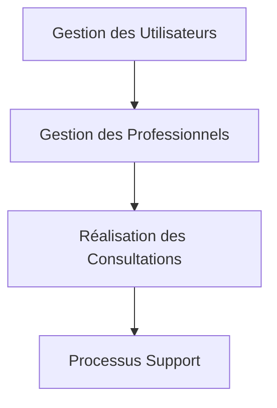
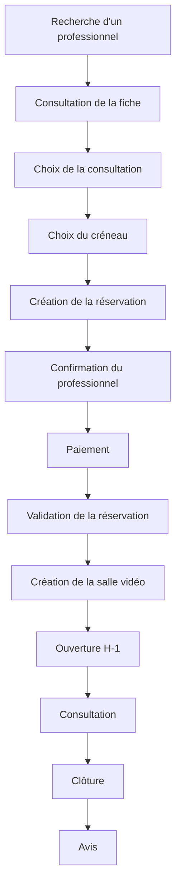

# Chaweer — Processus Métier

> Version : 2.0
>
> Statut : En cours de rédaction
>
> Auteur : Issam Majdoubi
>
> Relecture : CTO
>
> Dernière mise à jour : XX/XX/2026

---

# 1. Objectif

Le présent document décrit les processus métier de Chaweer.

Un processus métier représente un enchaînement d'activités permettant à un ou plusieurs acteurs d'atteindre un objectif métier précis tout en créant de la valeur pour l'ensemble de l'écosystème de la plateforme.

Ce document constitue la référence fonctionnelle décrivant le fonctionnement métier de Chaweer indépendamment de toute considération technique.

Il précise notamment :

- les principaux processus métier de la plateforme ;
- les acteurs impliqués dans chaque processus ;
- les objectifs poursuivis ;
- les déclencheurs ;
- les résultats attendus ;
- les interactions entre les objets métier.

Les règles détaillées régissant chacun de ces processus sont décrites dans le document **05-Regles-de-Gestion.md**.

---

# 2. Portée

Le présent document couvre exclusivement les processus métier de la Version 1 de Chaweer.

La Version 1 est volontairement centrée sur une offre de services limitée afin de proposer une première expérience utilisateur simple, cohérente et maîtrisée.

Le périmètre comprend notamment :

- la création et la gestion des comptes utilisateurs ;
- le parcours « Devenir Professionnel » ;
- la gestion du profil professionnel ;
- la publication d'une offre de consultation ;
- la gestion des disponibilités ;
- la réservation d'une consultation juridique ;
- la réalisation d'une consultation vidéo ;
- le paiement ;
- la publication d'un avis.

Les prestations reposant sur une logique de mission, telles que l'analyse de contrat, la rédaction d'actes, la rédaction de contrats, la vérification de documents ou la représentation juridique, ne font pas partie du périmètre de la Version 1.

Ces prestations feront l'objet de processus métier spécifiques dans une version ultérieure.

---

# 3. Principes

Les processus métier de Chaweer reposent sur les principes suivants.

## 3.1 Simplicité

Chaque processus doit être le plus simple possible pour l'utilisateur.

Le nombre d'étapes nécessaires à la réalisation d'une action est volontairement limité afin de proposer une expérience fluide.

---

## 3.2 Responsabilité des acteurs

Chaque activité est réalisée par un acteur clairement identifié.

Les responsabilités de chacun sont définies sans ambiguïté afin d'éviter tout chevauchement entre les rôles des utilisateurs, des professionnels et de la plateforme.

---

## 3.3 Indépendance de la solution technique

Les processus décrits dans ce document sont indépendants de leur implémentation informatique.

Ils décrivent le fonctionnement métier attendu sans présumer des choix techniques retenus pour leur réalisation.

---

## 3.4 Évolutivité

Les processus sont conçus pour évoluer progressivement au rythme des futures versions de Chaweer.

Les nouveaux services juridiques, les nouvelles professions ainsi que les nouvelles fonctionnalités devront pouvoir être intégrés sans remettre en cause les principes fondamentaux décrits dans ce document.

---

## 3.5 Traçabilité

Toute action ayant un impact métier doit pouvoir être tracée.

Les principales étapes d'un processus donnent lieu à la création ou à la mise à jour d'objets métier permettant de conserver un historique fiable des opérations réalisées.

---

# 4. Cartographie des processus métier

Les processus métier de Chaweer sont organisés en quatre grandes familles.

## 4.1 Gestion des Utilisateurs

Cette famille regroupe les processus permettant à une personne de créer un compte, d'accéder à la plateforme et de gérer son profil.

Elle comprend notamment :

- l'inscription ;
- l'authentification ;
- la gestion du profil utilisateur.

---

## 4.2 Gestion des Professionnels

Cette famille couvre l'ensemble du cycle de vie du professionnel sur la plateforme.

Elle comprend notamment :

- le parcours « Devenir Professionnel » ;
- la publication du profil professionnel ;
- la gestion de l'offre de consultation ;
- la gestion de l'agenda ;
- la gestion des réservations ;
- la réalisation des consultations.

---

## 4.3 Réalisation des Consultations

Cette famille décrit le principal processus métier de la Version 1.

Elle couvre l'ensemble du parcours permettant à un utilisateur de réserver puis de réaliser une consultation juridique avec un professionnel.

Ce processus constitue le cœur fonctionnel de Chaweer.

---

## 4.4 Processus Support

Les processus support interviennent de manière transverse afin d'accompagner les processus métier principaux.

Ils comprennent notamment :

- le paiement ;
- les notifications ;
- la réputation ;
- l'administration de la plateforme.

Ils ne créent pas directement de valeur métier mais garantissent le bon fonctionnement de l'ensemble de l'écosystème.

# 5. Processus de gestion des utilisateurs

Les processus de gestion des utilisateurs couvrent l'ensemble du cycle de vie d'un utilisateur sur la plateforme, depuis la création de son compte jusqu'à la gestion de ses informations personnelles.

Ils constituent le point d'entrée de tous les parcours métier de Chaweer.

---

## 5.1 Inscription

### Objectif

Permettre à une personne de créer un compte Chaweer afin d'accéder aux services proposés par la plateforme.

### Déclencheur

Le visiteur souhaite utiliser les services de Chaweer.

### Acteurs concernés

- Visiteur
- Plateforme

### Préconditions

Aucune.

### Déroulement

Le visiteur :

- renseigne les informations demandées ;
- accepte les conditions générales d'utilisation ;
- valide son adresse électronique/compte google ou son numéro de téléphone selon le mode d'inscription retenu.

À l'issue de cette étape, un compte Utilisateur est créé.

Le nouvel utilisateur peut :

- utiliser la plateforme comme client ;
- ou démarrer immédiatement le parcours **Devenir Professionnel**.

### Résultat

Le compte Utilisateur est créé et actif.

---

## 5.2 Authentification

### Objectif

Permettre à un utilisateur d'accéder à son espace personnel de manière sécurisée.

### Déclencheur

L'utilisateur souhaite accéder à son compte.

### Acteurs concernés

- Utilisateur
- Plateforme

### Préconditions

Le compte existe.

### Déroulement

L'utilisateur :

- saisit ses identifiants ;
- est authentifié par la plateforme.

Après authentification, Chaweer adapte automatiquement les fonctionnalités disponibles selon le profil de l'utilisateur.

### Résultat

L'utilisateur accède à son espace personnel.

---

## 5.3 Gestion du profil utilisateur

### Objectif

Permettre à l'utilisateur de maintenir ses informations personnelles à jour.

### Déclencheur

L'utilisateur souhaite modifier son profil.

### Acteurs concernés

- Utilisateur

### Préconditions

L'utilisateur est authentifié.

### Déroulement

L'utilisateur peut notamment :

- modifier ses informations personnelles ;
- modifier ses coordonnées ;
- modifier sa photo de profil ;
- consulter l'historique de ses consultations ;
- gérer les paramètres de son compte.

Les modifications sont immédiatement prises en compte.

### Résultat

Le profil utilisateur est mis à jour.

---

# 6. Processus de gestion des professionnels

Les processus de gestion des professionnels couvrent l'ensemble du cycle de vie d'un professionnel sur Chaweer.

Ils permettent à un utilisateur de proposer des consultations juridiques via la plateforme.

---

## 6.1 Parcours « Devenir Professionnel »

### Objectif

Permettre à une personne de créer ou d'activer un compte professionnel afin de proposer des consultations juridiques sur Chaweer.

### Déclencheur

Le parcours peut être initié dans deux situations :

- un visiteur choisit l'option « Vous êtes avocat ? Créer un compte professionnel » lors de son inscription ;
- un utilisateur déjà inscrit souhaite devenir professionnel.

### Acteurs concernés

- Visiteur
- Utilisateur
- Plateforme

### Préconditions

Aucune.

Si la personne possède déjà un compte Chaweer, celui-ci est réutilisé.

### Déroulement

Le candidat professionnel :

- choisit le parcours « Devenir Professionnel » ;
- renseigne les informations professionnelles demandées ;
- complète son profil ;
- accepte les conditions applicables aux professionnels.

Si le candidat ne possède pas encore de compte Chaweer, un compte Utilisateur est créé automatiquement au cours du processus.

À l'issue du parcours, le compte dispose des fonctionnalités professionnelles.

### Résultat

Le professionnel peut configurer son offre de consultation, son agenda et publier son profil dans l'annuaire dès que les informations minimales requises sont renseignées.

### Objectif

Permettre à un utilisateur/visiteur  d'activer un profil professionnel.

### Déclencheur

Le visiteur choisit le parcours « Devenir Professionnel » lors de son inscription ou un utilisateur existant souhaite proposer ses services sur Chaweer.

### Acteurs concernés

- Utilisateur
- Plateforme

### Préconditions

L'utilisateur possède un compte Chaweer.

### Déroulement

L'utilisateur :

- choisit la profession « Avocat » ;
- renseigne les informations professionnelles demandées ;
- complète son profil ;
- configure les informations minimales obligatoires.

À l'issue du parcours, le compte utilisateur devient également un compte professionnel.

En Version 1, aucune validation manuelle par Chaweer n'est requise.

### Résultat

Le professionnel peut publier son profil et commencer à configurer son activité.

---

## 6.2 Publication du profil professionnel

### Objectif

Permettre au professionnel de rendre son profil visible dans l'annuaire.

### Déclencheur

Le professionnel complète les informations obligatoires de son profil.

### Acteurs concernés

- Professionnel
- Plateforme

### Préconditions

Le parcours « Devenir Professionnel » est terminé.

### Déroulement

Le professionnel complète les informations requises.

Lorsque les informations minimales sont présentes, la plateforme publie automatiquement le profil.

Le profil devient immédiatement visible dans l'annuaire.

Aucune validation préalable n'est réalisée par Chaweer en Version 1.

### Résultat

Le professionnel est visible dans les résultats de recherche.

---

## 6.3 Gestion de l'offre de consultation

### Objectif

Permettre au professionnel de proposer sa consultation juridique.

### Déclencheur

Le professionnel souhaite configurer son offre.

### Acteurs concernés

- Professionnel

### Préconditions

Le profil professionnel est publié.

### Déroulement

Le professionnel configure son unique offre de consultation.

Il définit notamment :

- le prix ;
- la durée ;
- les modalités de réalisation.

Le professionnel peut modifier cette offre à tout moment.

En Version 1, un professionnel ne peut disposer que d'une seule offre de consultation.

### Résultat

L'offre de consultation est publiée et disponible à la réservation.

---

## 6.4 Gestion de l'agenda

### Objectif

Permettre au professionnel de gérer ses disponibilités.

### Déclencheur

Le professionnel souhaite ouvrir ou modifier ses créneaux.

### Acteurs concernés

- Professionnel

### Préconditions

Une offre de consultation est publiée.

### Déroulement

Le professionnel configure son agenda.

Il peut notamment :

- définir ses plages de disponibilité ;
- ouvrir des créneaux ;
- bloquer des créneaux ;
- supprimer des disponibilités.

Les créneaux générés deviennent immédiatement réservables.

Chaque professionnel dispose d'un agenda unique.

### Résultat

Les disponibilités sont publiées et peuvent être réservées par les utilisateurs.

## 6.5 Gestion des réservations

### Objectif

Permettre au professionnel de gérer les demandes de réservation de consultations qui lui sont adressées.

### Déclencheur

Une demande de réservation est créée par un utilisateur.

### Acteurs concernés

- Professionnel
- Utilisateur
- Plateforme

### Préconditions

- Le professionnel possède une offre de consultation active.
- Le créneau demandé est disponible.

### Déroulement

Lorsqu'une demande de réservation est reçue, le professionnel est notifié.

Il peut :

- consulter les informations de la demande ;
- confirmer la réservation ;
- refuser la réservation.

En cas de confirmation :

- la réservation passe à l'état **Confirmée** ;
- l'utilisateur est invité à procéder au paiement.

En cas de refus :

- la réservation est clôturée ;
- le créneau redevient disponible ;
- l'utilisateur est informé de la décision.

### Résultat

La réservation est soit confirmée en attente de paiement, soit refusée.

---

## 6.6 Réalisation des consultations

### Objectif

Permettre au professionnel de réaliser une consultation juridique dans les conditions prévues par la plateforme.

### Déclencheur

Une réservation confirmée a été payée.

### Acteurs concernés

- Professionnel
- Utilisateur
- Plateforme

### Préconditions

- La réservation est confirmée.
- Le paiement est validé.
- La salle de visioconférence a été créée.

### Déroulement

Une heure avant le début de la consultation, la plateforme ouvre automatiquement l'accès à la salle de visioconférence.

À l'heure prévue :

- le professionnel rejoint la consultation ;
- l'utilisateur rejoint la consultation ;
- la consultation se déroule.

À son issue, le professionnel clôture la consultation.

Il peut, s'il le souhaite, ajouter un compte rendu ou des commentaires destinés au client.

Cette étape est facultative.

Après la clôture :

- la consultation est archivée ;
- l'utilisateur est invité à déposer un avis ;
- le processus de versement des fonds au professionnel est engagé conformément aux règles de paiement.

### Résultat

La consultation est terminée et archivée.

Les deux parties retrouvent la consultation dans leur historique.

---

# 7. Processus principal — Réservation d'une consultation

La réservation d'une consultation constitue le processus métier central de la Version 1 de Chaweer.

Il décrit le parcours complet permettant à un utilisateur de réserver puis de réaliser une consultation juridique avec un professionnel.

## 7.1 Objectif

Permettre à un utilisateur de réserver une consultation juridique auprès d'un professionnel de manière simple, sécurisée et entièrement dématérialisée.

## 7.2 Acteurs concernés

- Utilisateur
- Professionnel
- Plateforme

## 7.3 Préconditions

- Le professionnel possède une offre de consultation active.
- Le professionnel dispose de créneaux disponibles.
- L'utilisateur est authentifié.

## 7.4 Déroulement

### Étape 1 — Recherche

L'utilisateur recherche un professionnel dans l'annuaire.

Après consultation de sa fiche, il sélectionne l'offre de consultation proposée.

### Étape 2 — Choix du créneau

L'utilisateur consulte les disponibilités du professionnel et sélectionne un créneau libre.

Une demande de réservation est créée.

### Étape 3 — Confirmation

Le professionnel examine la demande.

Il peut :

- confirmer la réservation ;
- refuser la réservation.

### Étape 4 — Paiement

Après confirmation, l'utilisateur procède au paiement.

La réservation devient définitive uniquement après validation du paiement.

### Étape 5 — Préparation

La plateforme crée automatiquement la salle de visioconférence.

L'accès est ouvert une heure avant le rendez-vous.

### Étape 6 — Consultation

Les deux parties rejoignent la salle et réalisent la consultation.

### Étape 7 — Clôture

Le professionnel clôture la consultation.

Le processus financier est poursuivi conformément aux règles de paiement.

L'utilisateur est invité à publier un avis.

## 7.5 Résultat

La consultation est réalisée.

La réservation est clôturée.

La consultation est archivée.

Le professionnel peut être évalué.

# 8. Processus support

Les processus support accompagnent les processus métier principaux de Chaweer.

Ils ne constituent pas le cœur de l'activité de la plateforme, mais garantissent son bon fonctionnement, sa fiabilité et la qualité de l'expérience utilisateur.

---

## 8.1 Paiement

### Objectif

Permettre le règlement sécurisé des consultations réservées sur la plateforme.

### Déclencheur

Une réservation a été confirmée par le professionnel.

### Acteurs concernés

- Utilisateur
- Plateforme
- Prestataire de paiement

### Préconditions

- La réservation est confirmée.
- Le paiement est attendu.

### Déroulement

L'utilisateur procède au paiement de la consultation.

La plateforme vérifie le résultat de la transaction.

En cas de succès :

- la réservation est définitivement validée ;
- la salle de visioconférence est préparée ;
- les parties sont notifiées.

En cas d'échec :

- la réservation reste en attente de paiement pendant la durée prévue ;
- à défaut de paiement, la réservation est automatiquement annulée.

### Résultat

Le paiement est enregistré et la réservation poursuit son cycle de vie.

---

## 8.2 Notifications

### Objectif

Informer les utilisateurs des événements importants survenant au cours des différents processus métier.

### Déclencheur

Tout changement significatif intervenant dans un processus métier.

### Acteurs concernés

- Plateforme
- Utilisateur
- Professionnel

### Déroulement

La plateforme envoie les notifications appropriées selon l'événement.

Exemples :

- création du compte ;
- publication du profil professionnel ;
- nouvelle demande de réservation ;
- confirmation de réservation ;
- refus de réservation ;
- paiement accepté ;
- paiement refusé ;
- rappel avant consultation ;
- ouverture de la salle de visioconférence ;
- consultation terminée ;
- invitation à déposer un avis.

### Résultat

Les acteurs concernés sont informés en temps utile des événements impactant leur activité.

---

## 8.3 Réputation

### Objectif

Permettre d'évaluer la qualité des prestations proposées par les professionnels.

### Déclencheur

Une consultation est clôturée.

### Acteurs concernés

- Utilisateur
- Professionnel
- Plateforme

### Préconditions

La consultation est terminée.

### Déroulement

Après la consultation :

- l'utilisateur est invité à publier un avis ;
- la plateforme met à jour les indicateurs de réputation du professionnel ;
- les informations sont prises en compte dans son profil public.

Les modalités de calcul sont décrites dans le document **07-Reputation.md**.

### Résultat

La réputation du professionnel est actualisée.

---

## 8.4 Administration

### Objectif

Permettre l'administration et le bon fonctionnement de la plateforme.

### Acteurs concernés

- Administrateur

### Déroulement

Les administrateurs assurent notamment :

- la gestion du catalogue des prestations ;
- la gestion des référentiels ;
- la modération des contenus ;
- le traitement des signalements ;
- le suivi de l'activité de la plateforme.

Les fonctionnalités d'administration sont réservées aux utilisateurs autorisés.

### Résultat

Le fonctionnement global de Chaweer est assuré.

---

# 9. Hors périmètre de la Version 1

La Version 1 est exclusivement dédiée à la consultation juridique.

Les prestations suivantes ne sont pas couvertes par les processus décrits dans ce document :

- analyse de contrat ;
- rédaction d'actes ;
- rédaction de contrats ;
- vérification de documents ;
- représentation et suivi de procédures ;
- toute autre prestation reposant sur une logique de mission ou de livraison.

Ces prestations feront l'objet de processus métier spécifiques dans les versions ultérieures.

---

# 10. Références

Le présent document est complété par les documents suivants :

- 00-Architecture-Metier.md
- 01-Glossaire.md
- 02-Acteurs.md
- 03-Catalogue-Prestations.md
- 05-Regles-de-Gestion.md
- 06-Modele-Metier.md
- 07-Reputation.md

Les règles détaillées décrivant les contraintes métier applicables à chacun des processus sont définies dans **05-Regles-de-Gestion.md**.