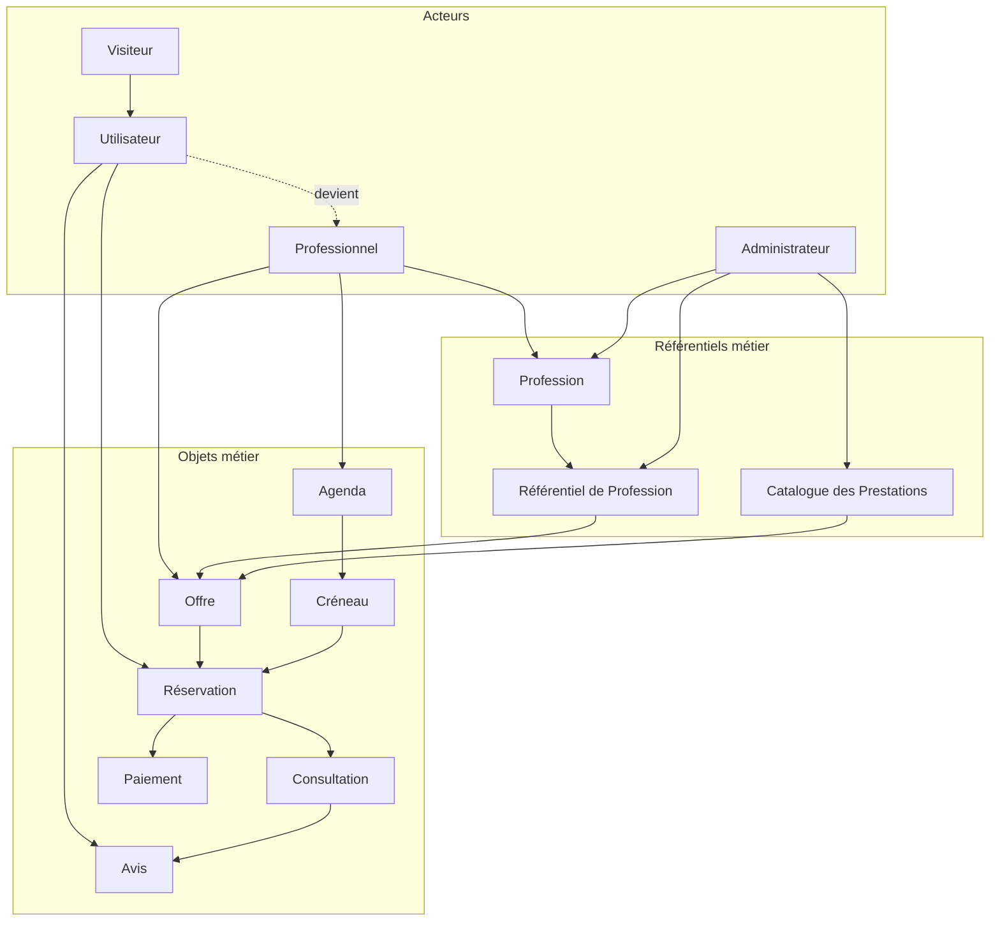

# Modèle Métier – Chaweer

> Version : 2.0
>
> Statut : En rédaction
>
> Auteur : Issam Majdoubi
>
> Référentiel : Domaine Métier

---

# 1. Objectif

Le présent document décrit le modèle métier de Chaweer.

Il constitue la référence officielle du domaine métier de la plateforme.

Son objectif est de formaliser les concepts métier, leurs responsabilités, leurs relations, leurs règles d'organisation et leur cycle de vie afin de garantir une compréhension commune du fonctionnement de la plateforme.

Ce document est indépendant de toute implémentation technique. Il ne décrit ni la structure de la base de données, ni les API, ni l'architecture logicielle, ni les interfaces utilisateur.

Le modèle métier constitue le socle fonctionnel de Chaweer. Il sert de référence à l'ensemble des parties prenantes du projet et garantit la cohérence des évolutions fonctionnelles.

---

# Ce document sert de référence pour

- comprendre le domaine métier de Chaweer ;
- définir les objets métier de la plateforme ;
- formaliser les responsabilités de chaque concept métier ;
- décrire les relations entre les différents concepts ;
- concevoir les fonctionnalités de la plateforme ;
- guider la conception technique ;
- assurer la cohérence du développement ;
- définir les cas de test fonctionnels ;
- accompagner l'évolution progressive du produit.

---

# 2. Portée

Le présent document décrit le cœur du domaine métier de Chaweer.

Il couvre notamment :

- les objets métier ;
- les référentiels métier utilisés par ces objets ;
- les relations entre les différents concepts ;
- les responsabilités de chaque objet métier ;
- les principaux cycles de vie ;
- les règles d'organisation générales du domaine.

En revanche, il ne détaille pas les processus métier, les règles de gestion, les interfaces utilisateurs ni les aspects techniques de mise en œuvre.

Ces éléments sont documentés dans les référentiels dédiés.

---

# 3. Documents de référence

Le présent document s'appuie sur les référentiels suivants :

| Document | Description |
|----------|-------------|
| 00-Architecture-Metier.md | Architecture globale du domaine métier |
| 01-Glossaire.md | Définitions des termes métier |
| 02-Acteurs.md | Description des acteurs métier |
| 03-Catalogue-Prestations.md | Catalogue officiel des prestations |
| 04-Processus.md | Processus métier |
| 05-Regles-de-Gestion.md | Règles de gestion |
| 07-Reputation.md | Gestion de la réputation |
| 08-Classement.md | Classement des professionnels |
| 09-Paiements.md | Paiements |
| 10-Notifications.md | Notifications |
| 11-Litiges.md | Gestion des litiges |
| 12-Politiques.md | Politiques de la plateforme |

---
# 4. Vision du domaine

Chaweer est une plateforme numérique de services juridiques ayant pour vocation de faciliter la mise en relation entre les justiciables et les professionnels du droit réglementés.

La plateforme ne constitue pas un cabinet juridique. Elle fournit un cadre sécurisé permettant aux utilisateurs de rechercher un professionnel, de réserver une prestation, d'effectuer un paiement, de réaliser une consultation et d'interagir tout au long du parcours de service.

Le domaine métier de Chaweer est construit afin de répondre à trois objectifs majeurs :

- faciliter l'accès aux services juridiques ;
- offrir aux professionnels un environnement leur permettant de développer leur activité ;
- garantir un fonctionnement homogène, évolutif et administrable de la plateforme.

Le modèle métier est conçu selon une architecture générique permettant d'intégrer progressivement de nouvelles professions juridiques sans remettre en cause les concepts fondamentaux du domaine.

Dans sa première version, Chaweer prend uniquement en charge la profession d'Avocat.

Le modèle métier a toutefois été conçu pour intégrer ultérieurement d'autres professions réglementées telles que les Notaires, les Commissaires de justice, les Experts judiciaires ou les Traducteurs assermentés.

L'ensemble du domaine repose sur une séparation claire entre les acteurs, les référentiels métier, les objets métier et les processus métier.

Cette organisation permet de garantir la cohérence fonctionnelle de la plateforme tout en facilitant son évolution.

# 5. Architecture du domaine métier

Le domaine métier de Chaweer est organisé autour de quatre grandes familles de concepts.

## 5.1 Acteurs métier

Les acteurs représentent les personnes ou les rôles qui interagissent avec la plateforme.

Ils exécutent les différents parcours métier mais ne constituent pas nécessairement des objets métier.

Les acteurs sont décrits dans le document **02-Acteurs.md**.

Les principaux acteurs sont notamment :

- Visiteur
- Utilisateur
- Professionnel
- Administrateur

---

## 5.2 Référentiels métier

Les référentiels regroupent les données administrées par Chaweer.

Ils garantissent une nomenclature unique et homogène pour l'ensemble de la plateforme.

Ils constituent les sources officielles des données de référence utilisées par les objets métier.

Parmi les principaux référentiels figurent notamment :

- les Professions ;
- les Référentiels de Profession ;
- le Catalogue des prestations.

Chaque profession possède son propre référentiel définissant notamment :

- les spécialités ;
- les services proposés ;
- les documents de vérification ;
- les informations constituant le profil professionnel ;
- les règles spécifiques applicables à la profession.

Les référentiels sont exclusivement administrés par Chaweer.

---

## 5.3 Objets métier

Les objets métier représentent les concepts manipulés par la plateforme.

Ils portent les informations métier, les responsabilités, les relations et les cycles de vie nécessaires au fonctionnement de Chaweer.

Ils constituent le cœur du présent document.

Chaque objet métier est défini indépendamment de son implémentation technique.

---

## 5.4 Processus métier

Les processus métier décrivent les interactions entre les différents acteurs et les objets métier.

Ils orchestrent les différentes étapes du parcours utilisateur, depuis la recherche d'un professionnel jusqu'à la clôture d'une prestation.

Les processus sont documentés dans **04-Processus.md**.

# 6. Principes structurants du domaine

Le modèle métier de Chaweer repose sur un ensemble de principes destinés à garantir la cohérence fonctionnelle, la maintenabilité et l'évolutivité de la plateforme.

Ces principes s'appliquent à l'ensemble des objets métier et des référentiels du domaine.

---

## 6.1 Séparation des responsabilités

Chaque concept métier possède une responsabilité unique et clairement identifiée.

Un concept ne doit porter que les informations nécessaires à sa responsabilité.

Par exemple :

- l'Utilisateur porte l'identité de la personne ;
- le Professionnel porte son activité professionnelle ;
- l'Offre porte les caractéristiques commerciales d'une prestation ;
- la Réservation porte l'engagement entre un client et un professionnel.

Cette séparation limite les dépendances entre les concepts et facilite les évolutions futures.

---

## 6.2 Les référentiels sont la source de vérité

Les référentiels constituent les sources officielles des données de référence de la plateforme.

Ils sont administrés exclusivement par Chaweer.

Les objets métier utilisent ces référentiels sans les dupliquer.

À titre d'exemple :

- une Profession est définie dans le référentiel des professions ;
- une Spécialité est définie dans le référentiel de la profession ;
- une Prestation est définie dans le Catalogue des prestations.

---

## 6.3 Les objets métier représentent les activités de la plateforme

Les objets métier matérialisent les interactions entre les différents acteurs.

Ils décrivent les informations manipulées tout au long du parcours utilisateur.

Chaque objet métier possède notamment :

- une responsabilité ;
- des données métier ;
- un cycle de vie ;
- des relations avec les autres objets ;
- des règles de gestion associées.

---

## 6.4 Les relations entre objets métier

Les objets métier ne sont pas isolés.

Ils collaborent afin de représenter un processus métier complet.

À titre d'exemple :

- un Utilisateur effectue une Réservation ;
- une Réservation concerne une Offre ;
- une Offre appartient à un Professionnel ;
- un Professionnel exerce une Profession ;
- une Consultation est issue d'une Réservation ;
- un Paiement valide une Réservation ;
- un Avis évalue une Consultation.

L'ensemble de ces relations constitue le modèle métier de Chaweer.

---

## 6.5 Évolutivité du modèle

Le modèle métier est conçu pour évoluer progressivement.

L'ajout d'une nouvelle profession ne doit pas remettre en cause l'organisation générale du domaine.

Chaque nouvelle profession est intégrée au travers de son propre Référentiel de Profession.

Les objets métier existants continuent d'être utilisés sans modification majeure.

---

## 6.6 Indépendance de l'implémentation

Le modèle métier est indépendant des choix techniques.

Un objet métier ne correspond pas nécessairement à une table de base de données, une API ou une classe logicielle.

Il décrit un concept métier.

Son implémentation pourra évoluer sans remettre en cause le modèle fonctionnel.

## 6.7 Collecte progressive des informations

Chaweer applique le principe de collecte progressive des informations.

Une donnée métier n'est demandée à un utilisateur que lorsqu'elle devient nécessaire à l'exécution d'un processus métier.

Ce principe permet :

- de réduire les frictions lors de l'inscription ;
- d'améliorer le taux de conversion ;
- de simplifier l'expérience utilisateur ;
- de limiter la collecte de données personnelles.

Les profils utilisateurs et professionnels peuvent ainsi être enrichis progressivement tout au long de leur utilisation de la plateforme.

# 7. Cartographie du domaine métier

Le domaine métier de Chaweer est organisé autour de plusieurs familles de concepts qui collaborent afin de couvrir l'ensemble du parcours utilisateur.

Cette cartographie permet de comprendre rapidement les principales dépendances fonctionnelles entre les concepts du domaine.

## Lecture de la cartographie

Le domaine métier repose sur trois axes principaux.

### Les acteurs

Les acteurs utilisent la plateforme.

Ils initient les différents processus métier.

Le Visiteur peut consulter librement les contenus publics.

L'Utilisateur dispose d'un compte lui permettant d'accéder aux services de Chaweer.

Le Professionnel est un Utilisateur autorisé à proposer des prestations juridiques.

L'Administrateur assure l'administration fonctionnelle de la plateforme.

---

### Les référentiels

Les référentiels constituent les sources officielles des données de référence.

Ils sont administrés exclusivement par Chaweer.

Ils garantissent la cohérence fonctionnelle de l'ensemble de la plateforme.

Les principaux référentiels sont :

- les Professions ;
- les Référentiels de Profession ;
- le Catalogue des Prestations.

---

### Les objets métier

Les objets métier représentent les informations manipulées au cours des différents processus.

Ils décrivent notamment :

- les offres proposées ;
- les disponibilités ;
- les réservations ;
- les consultations ;
- les paiements ;
- les avis.
# 9. Les objets métier

Les objets métier représentent les concepts fonctionnels manipulés par Chaweer.

Ils constituent le cœur du modèle métier et permettent de décrire les informations, les responsabilités et les interactions nécessaires au fonctionnement de la plateforme.

Chaque objet métier est défini indépendamment de son implémentation technique.

Un objet métier ne correspond pas nécessairement à une table de base de données, une API ou un composant logiciel. Il représente avant tout un concept du domaine fonctionnel.

Tous les objets métier décrits dans ce document respectent une structure commune afin de garantir une documentation homogène.

Chaque objet métier est décrit selon les rubriques suivantes :

- Définition
- Rôle dans l'écosystème
- Responsable métier
- Données métier
- Capacités
- Relations
- Cycle de vie
- Règles de gestion associées
- Objectif Business
- Évolutions futures

Cette structure facilite la compréhension du domaine et garantit une cohérence entre les différents concepts métier.

# 9.1 Utilisateur

> Version : V1

## Définition

L'Utilisateur représente toute personne physique disposant d'un compte sur la plateforme Chaweer.

Il constitue l'identité métier de référence permettant d'accéder aux fonctionnalités proposées par la plateforme.

L'Utilisateur est le point d'entrée de l'ensemble des parcours métier.

Il peut utiliser Chaweer pour rechercher un professionnel, réserver une prestation, effectuer un paiement, participer à une consultation et suivre son historique.

L'Utilisateur est distinct du Visiteur.

Le Visiteur consulte librement les contenus publics de la plateforme sans disposer d'un compte.

À l'inverse, l'Utilisateur est authentifié et bénéficie des services nécessitant une identification.

Un Utilisateur peut également exercer une profession juridique réglementée.

Dans ce cas, il est associé à un objet métier **Professionnel**.

Dans la Version 1, tous les utilisateurs sont des personnes physiques.

---

## Rôle dans l'écosystème

L'Utilisateur constitue le principal consommateur des services proposés par Chaweer.

Il intervient dans la majorité des processus métier :

- création d'un compte ;
- recherche d'un professionnel ;
- consultation des profils ;
- réservation d'une prestation ;
- paiement ;
- participation à une consultation ;
- dépôt d'un avis.

L'Utilisateur est également le propriétaire de ses données personnelles.

---

## Responsable métier

L'Utilisateur est responsable :

- de son identité ;
- de ses coordonnées ;
- des informations de son profil ;
- de la confidentialité de son compte.

Chaweer est responsable :

- de l'authentification ;
- de la sécurité du compte ;
- du respect des politiques de confidentialité ;
- du cycle de vie du compte.

---

## Données métier

L'Utilisateur possède un profil évolutif.

Chaweer applique le principe de **collecte progressive des informations** (Progressive Profiling).

Seules les informations strictement nécessaires sont demandées à chaque étape du parcours utilisateur.

Les informations complémentaires sont collectées uniquement lorsqu'elles deviennent nécessaires à l'utilisation d'un service.

### Identification

L'identification d'un utilisateur repose sur au moins un moyen de connexion.

Exemples :

- Adresse e-mail
- Numéro de téléphone
- Compte Google
- Autres fournisseurs d'identité (versions futures)

### Informations personnelles

Les informations personnelles sont facultatives lors de la création du compte.

Elles peuvent être complétées ultérieurement.

Exemples :

- Prénom
- Nom
- Photo de profil
- Date de naissance
- Sexe

### Préférences

Les préférences utilisateur sont optionnelles.

Exemples :

- Langue
- Préférences de notification

### Traçabilité

Chaweer conserve les informations nécessaires au suivi du cycle de vie du compte.

- Date de création
- Dernière connexion
- Dernière mise à jour

### Statut

- En attente d'activation
- Actif
- Suspendu
- Fermé

---

## Capacités

Un Utilisateur peut :

- créer un compte ;
- s'authentifier ;
- modifier ses informations personnelles ;
- gérer ses préférences ;
- rechercher un professionnel ;
- consulter des offres ;
- réserver une prestation ;
- effectuer un paiement ;
- consulter son historique ;
- participer à une consultation ;
- publier un avis ;
- demander la fermeture de son compte.

Certaines fonctionnalités dépendent de son éventuel statut de Professionnel.

---

## Relations

Un Utilisateur :

- peut devenir Professionnel ;
- peut effectuer plusieurs réservations ;
- peut réaliser plusieurs paiements ;
- peut participer à plusieurs consultations ;
- peut publier plusieurs avis.

### Cardinalités

Utilisateur (1) ─────── (0..1) Professionnel

Utilisateur (1) ─────── (N) Réservation

Utilisateur (1) ─────── (N) Paiement

Utilisateur (1) ─────── (N) Consultation

Utilisateur (1) ─────── (N) Avis

---

## Cycle de vie

Créé

↓

En attente d'activation

↓

Actif

↓

Suspendu

↓

Fermé

---

## Règles de gestion associées

- RG-CPT
- RG-AUTH
- RG-PRIV

---

## Objectif Business

Le modèle Utilisateur a été conçu pour minimiser les frictions lors de l'inscription.

Chaweer privilégie une expérience simple et rapide en limitant les informations demandées lors de la création du compte.

Les informations complémentaires sont collectées progressivement en fonction des besoins des différents parcours métier.

Cette approche favorise l'acquisition des utilisateurs tout en garantissant la disponibilité des informations nécessaires lorsque celles-ci deviennent indispensables.

---

## Évolutions futures

### Version 2

- Comptes Entreprise
- Comptes représentant légal
- Gestion de plusieurs moyens d'authentification

### Version 3

- Organisations
- Comptes multi-utilisateurs
- Délégation de gestion
- Authentification fédérée

# 9.2 Professionnel

> Version : V1

## Définition

Le Professionnel représente un Utilisateur autorisé à proposer des prestations juridiques sur la plateforme Chaweer.

Il constitue le fournisseur de services de la marketplace.

Le Professionnel ne possède pas de compte distinct. Il s'agit d'un Utilisateur ayant complété un parcours d'onboarding professionnel et dont le profil est autorisé à publier des prestations.

Chaque Professionnel exerce une unique Profession juridique réglementée.

Les caractéristiques propres à cette profession sont définies dans le Référentiel de Profession correspondant.

Dans la Version 1, seule la profession d'Avocat est prise en charge.

---

## Rôle dans l'écosystème

Le Professionnel met son expertise à disposition des utilisateurs.

Il construit progressivement sa présence sur la plateforme grâce à :

- son profil professionnel ;
- ses offres ;
- ses disponibilités ;
- la qualité de ses consultations ;
- les avis de ses clients ;
- son score de réputation.

Le Professionnel constitue le principal créateur de valeur de Chaweer.

---

## Responsabilités

Le Professionnel est responsable :

- de l'exactitude des informations de son profil ;
- des prestations qu'il propose ;
- de ses disponibilités ;
- de la qualité des consultations réalisées ;
- du respect des obligations liées à sa profession.

Chaweer est responsable :

- de la publication du profil ;
- du contrôle du respect des règles de la plateforme ;
- de la modération ;
- des éventuelles suspensions.

---

## Données métier

Le modèle Professionnel est construit autour de plusieurs ensembles d'informations.

### Profession

Le Professionnel exerce une profession juridique réglementée.

Exemples :

- Avocat
- Notaire
- Commissaire de justice
- Expert judiciaire
- Traducteur assermenté

Chaque Profession est définie dans son Référentiel de Profession.

---

### Informations professionnelles

Selon la profession exercée, le profil peut notamment comporter :

- numéro d'inscription professionnelle ;
- ordre professionnel ;
- barreau ;
- années d'expérience ;
- langues parlées ;
- ville d'exercice ;
- adresse professionnelle.

Les informations disponibles dépendent du Référentiel de Profession.

---

### Profil public

Le profil public représente les informations visibles par les utilisateurs.

Il peut notamment comprendre :

- photo ;
- biographie ;
- spécialités ;
- expériences ;
- langues ;
- indicateurs de réputation.

---

### Vérification

Le Professionnel possède un statut de vérification.

Exemples :

- Non vérifié
- Vérification en cours
- Vérifié
- Suspendu

Les modalités de vérification dépendent de la profession exercée.

---

### Statut

- En onboarding
- Actif
- Suspendu
- Archivé

---

## Capacités

Un Professionnel peut notamment :

- compléter son profil ;
- publier des offres ;
- gérer ses disponibilités ;
- accepter ou refuser une réservation ;
- proposer un autre créneau ;
- réaliser une consultation ;
- publier un compte rendu ;
- répondre à un avis ;
- consulter ses statistiques d'activité.

Les capacités disponibles peuvent varier selon la profession exercée.

---

## Relations

Un Professionnel :

- est associé à un unique Utilisateur ;
- exerce une unique Profession ;
- dépend d'un Référentiel de Profession ;
- possède plusieurs Offres ;
- possède un Agenda ;
- reçoit plusieurs Réservations ;
- réalise plusieurs Consultations ;
- reçoit plusieurs Avis.

### Cardinalités

Utilisateur (1) ─────── (0..1) Professionnel

Profession (1) ─────── (N) Professionnel

Référentiel de Profession (1) ─────── (N) Professionnel

Professionnel (1) ─────── (N) Offre

Professionnel (1) ─────── (1) Agenda

Professionnel (1) ─────── (N) Réservation

Professionnel (1) ─────── (N) Consultation

Professionnel (1) ─────── (N) Avis

---

## Cycle de vie

Création du compte

↓

Onboarding professionnel

↓

Vérification

↓

Publication

↓

Actif

↓

Suspendu

↓

Archivé

---

## Règles de gestion associées

- RG-PRO
- RG-OFR
- RG-AGD
- RG-RES
- RG-CNS
- RG-AVI

---

## Objectif Business

Le Professionnel constitue le principal fournisseur de services de Chaweer.

Le modèle métier a été conçu afin de permettre l'intégration progressive de nouvelles professions juridiques tout en conservant un fonctionnement homogène de la plateforme.

Chaque Professionnel s'appuie sur un Référentiel de Profession qui définit les informations, les règles et les fonctionnalités spécifiques à sa profession.

Cette approche garantit l'évolutivité du modèle métier sans remettre en cause les objets existants.

---

## Évolutions futures

### Version 2

- Intégration des Notaires
- Intégration des Commissaires de justice
- Intégration des Experts judiciaires
- Intégration des Traducteurs assermentés
- Vérification automatique auprès des ordres professionnels

### Version 3

- Cabinets
- Collaborateurs
- Assistants
- Gestion d'équipes
- Délégation de certaines actions
- Statistiques avancées

# 10. Les référentiels métier

Les référentiels métier regroupent les données de référence administrées par Chaweer.

Contrairement aux objets métier, les référentiels ne représentent pas des événements ou des interactions entre les acteurs de la plateforme.

Ils définissent le cadre fonctionnel dans lequel les objets métier évoluent.

Les référentiels garantissent :

- une nomenclature commune ;
- une homogénéité des informations ;
- une évolution maîtrisée de la plateforme ;
- la réutilisation des mêmes concepts par l'ensemble des professionnels.

Les référentiels sont exclusivement administrés par Chaweer.

Les professionnels les utilisent mais ne peuvent pas les modifier.

Dans la Version 1, les principaux référentiels sont :

- Profession ;
- Référentiel de Profession ;
- Catalogue des prestations.

# 10.1 Profession

> Version : V1

## Définition

Une Profession représente un métier juridique réglementé reconnu par Chaweer.

Elle constitue le premier niveau de structuration du domaine métier.

Chaque Profession définit un cadre fonctionnel propre et s'appuie sur un Référentiel de Profession qui regroupe l'ensemble des éléments nécessaires à son fonctionnement (spécialités, services, règles métier, documents, profil et workflow).

Une Profession est un référentiel administré exclusivement par Chaweer.

Elle ne peut être créée, modifiée ou supprimée par les Professionnels.

---

## Rôle dans l'écosystème

La Profession permet d'organiser les différents métiers juridiques supportés par la plateforme.

Elle constitue le point d'entrée de l'onboarding des Professionnels et détermine le référentiel applicable à chacun d'eux.

Chaque Profession possède son propre cadre fonctionnel tout en partageant un modèle métier commun avec les autres professions.

---

## Responsabilités

Une Profession définit notamment :

- son identité ;
- son Référentiel de Profession ;
- les conditions de rattachement des Professionnels ;
- les référentiels utilisés par cette profession.

La gestion des Professions relève exclusivement de Chaweer.

---

## Relations

Une Profession :

- possède un unique Référentiel de Profession ;
- regroupe plusieurs Professionnels.

### Cardinalités

Profession (1) ─────── (1) Référentiel de Profession

Profession (1) ─────── (N) Professionnel

---

## Cycle de vie

Créée

↓

Active

↓

Archivée

Une Profession archivée n'est plus proposée lors de l'onboarding de nouveaux Professionnels mais reste associée aux données historiques.

---

## Règles de gestion associées

- RG-PRF

---

## Objectif Business

La Profession constitue le premier niveau de structuration du domaine métier.

Elle permet d'intégrer progressivement de nouvelles professions juridiques tout en conservant une architecture homogène.

Chaque Profession dispose de son propre référentiel sans remettre en cause le fonctionnement global de la plateforme.

---

## Évolutions futures

### Version 2

- Ajout de nouvelles professions réglementées.
- Paramétrage spécifique par profession.

### Version 3

- Internationalisation des professions.
- Gestion des équivalences entre professions selon les juridictions.

# 10.2 Référentiel de Profession

> Version : V1

## Définition

Le Référentiel de Profession regroupe l'ensemble des informations, règles et nomenclatures propres à une Profession.

Il constitue la source de référence utilisée par Chaweer pour configurer le comportement métier de chaque profession juridique.

Chaque Profession possède un unique Référentiel de Profession.

Le contenu de ce référentiel est administré exclusivement par Chaweer.

---

## Rôle dans l'écosystème

Le Référentiel de Profession définit le cadre fonctionnel applicable aux Professionnels d'une même profession.

Il permet de standardiser les informations demandées, les prestations proposées, les documents requis et les règles spécifiques.

Les Professionnels utilisent ce référentiel mais ne peuvent pas le modifier.

---

## Composition

Un Référentiel de Profession peut notamment contenir :

- les spécialités ;
- le catalogue des services autorisés ;
- les informations du profil professionnel ;
- les documents de vérification ;
- les règles métier spécifiques ;
- le workflow d'onboarding ;
- les paramètres propres à la profession.

Chaque élément est documenté dans les référentiels spécialisés correspondants.

---

## Responsabilités

Le Référentiel de Profession définit notamment :

- les données attendues pour les Professionnels ;
- les spécialités disponibles ;
- les prestations autorisées ;
- les règles de validation ;
- les documents obligatoires ;
- le parcours d'onboarding.

Sa maintenance relève exclusivement de Chaweer.

---

## Relations

Un Référentiel de Profession :

- est associé à une unique Profession ;
- est utilisé par plusieurs Professionnels ;
- référence le Catalogue des prestations applicable à cette profession.

### Cardinalités

Profession (1) ─────── (1) Référentiel de Profession

Référentiel de Profession (1) ─────── (N) Professionnel

Référentiel de Profession (1) ─────── (1) Catalogue des prestations

---

## Cycle de vie

Créé

↓

Publié

↓

Mis à jour

↓

Archivé

Les évolutions du référentiel sont versionnées afin de garantir la cohérence des données historiques.

---

## Règles de gestion associées

- RG-REF

---

## Objectif Business

Le Référentiel de Profession centralise les règles propres à chaque profession juridique.

Il garantit une gestion homogène des Professionnels tout en permettant d'adapter les fonctionnalités aux spécificités de chaque métier.

Cette approche facilite l'ajout de nouvelles professions sans modifier les objets métier de la plateforme.

---

## Évolutions futures

### Version 2

- Versionnement des référentiels.
- Paramétrage avancé par profession.

### Version 3

- Héritage entre référentiels.
- Référentiels partagés entre plusieurs professions.
- Gestion multijuridiction.

# 10.3 Catalogue des prestations

> Version : V1

## Définition

Le Catalogue des prestations constitue le référentiel des prestations pouvant être proposées sur Chaweer.

Il recense l'ensemble des types de prestations disponibles pour une ou plusieurs professions.

Le Catalogue est administré exclusivement par Chaweer.

Les Professionnels ne créent pas de nouvelles prestations dans le Catalogue. Ils sélectionnent celles qu'ils souhaitent proposer au travers de leurs Offres.

---

## Rôle dans l'écosystème

Le Catalogue des prestations permet de standardiser les services proposés sur la plateforme.

Il garantit une nomenclature homogène des prestations et facilite :

- la recherche des services ;
- la comparaison des Offres ;
- le classement des Professionnels ;
- les statistiques d'activité.

Le Catalogue constitue la base de création des Offres publiées par les Professionnels.

---

## Composition

Chaque prestation du Catalogue définit notamment :

- son intitulé ;
- sa description ;
- la ou les professions concernées ;
- le mode de réalisation ;
- les paramètres fonctionnels éventuels.

Les conditions commerciales (prix, durée, disponibilité, promotions...) ne font pas partie du Catalogue.

---

## Responsabilités

Le Catalogue définit :

- les prestations disponibles ;
- leurs caractéristiques fonctionnelles ;
- leur rattachement aux professions concernées.

Sa gestion relève exclusivement de Chaweer.

---

## Relations

Le Catalogue des prestations :

- est utilisé par un ou plusieurs Référentiels de Profession ;
- sert de base à la création des Offres publiées par les Professionnels.

### Cardinalités

Catalogue des prestations (1) ─────── (N) Référentiel de Profession

Catalogue des prestations (1) ─────── (N) Offre

---

## Cycle de vie

Créée

↓

Publiée

↓

Mise à jour

↓

Archivée

Une prestation archivée ne peut plus être utilisée pour créer de nouvelles Offres mais reste liée aux données historiques.

---

## Règles de gestion associées

- RG-CAT

---

## Objectif Business

Le Catalogue des prestations constitue le référentiel commun des services proposés sur Chaweer.

Il garantit une présentation homogène des prestations, simplifie la création des Offres par les Professionnels et assure une expérience cohérente pour les Utilisateurs.

---

## Évolutions futures

### Version 2

- Paramètres spécifiques par profession.
- Catégorisation avancée des prestations.
- Prestations conditionnelles.

### Version 3

- Catalogue multilingue.
- Versionnement des prestations.
- Héritage entre catalogues.

# 11.1 Offre

> Version : V1

## Définition

L'Offre représente une prestation effectivement proposée par un Professionnel sur Chaweer.

Elle est créée à partir d'une prestation du Catalogue des prestations et adaptée par le Professionnel selon ses conditions d'exercice.

L'Offre constitue le point d'entrée du parcours de réservation.

Elle décrit les conditions dans lesquelles un Utilisateur peut réserver une prestation auprès d'un Professionnel.

---

## Rôle dans l'écosystème

L'Offre permet à un Professionnel de rendre ses services accessibles aux Utilisateurs.

Elle transforme une prestation de référence du Catalogue en une proposition commerciale concrète.

Chaque Offre peut être réservée plusieurs fois et constitue l'unité de base des réservations réalisées sur la plateforme.

---

## Responsabilités

L'Offre définit notamment :

- la prestation proposée ;
- le Professionnel qui la propose ;
- les modalités de réalisation ;
- les conditions commerciales ;
- sa disponibilité à la réservation.

Le Professionnel est responsable des informations et des conditions de son Offre.

Chaweer garantit sa publication et son accessibilité conformément aux règles de la plateforme.

---

## Données métier

Une Offre comprend notamment :

### Référence

- Identifiant
- Professionnel
- Prestation du Catalogue

### Informations commerciales

- Titre (si personnalisable)
- Description complémentaire
- Prix
- Devise

### Modalités

- Mode de réalisation (cabinet, visioconférence, téléphone…)
- Durée estimée
- Conditions particulières éventuelles

### Disponibilité

- Publiée
- Temporairement indisponible
- Archivée

---

## Capacités

Une Offre peut :

- être créée ;
- être publiée ;
- être modifiée ;
- être suspendue ;
- être archivée ;
- être réservée plusieurs fois.

---

## Relations

Une Offre :

- appartient à un seul Professionnel ;
- est basée sur une prestation du Catalogue ;
- peut faire l'objet de plusieurs Réservations.

### Cardinalités

Professionnel (1) ─────── (N) Offre

Catalogue des prestations (1) ─────── (N) Offre

Offre (1) ─────── (N) Réservation

---

## Cycle de vie

Créée

↓

Configurée

↓

Publiée

↓

Disponible à la réservation

↓

Suspendue

↓

Archivée

Une Offre archivée n'est plus réservable mais reste conservée pour l'historique.

---

## Règles de gestion associées

- RG-OFR

---

## Objectif Business

L'Offre constitue l'élément commercial de Chaweer.

Elle permet à un Professionnel de proposer une prestation standardisée du Catalogue selon ses propres conditions d'exercice, tout en garantissant une expérience homogène pour les Utilisateurs.

Elle représente le point de départ du processus de réservation et de consultation.

---

## Évolutions futures

### Version 2

- Tarification dynamique.
- Promotions.
- Offres saisonnières.
- Offres limitées dans le temps.

### Version 3

- Packs de prestations.
- Abonnements.
- Offres combinées.
- Personnalisation avancée des conditions commerciales.

# 11.2 Agenda

> Version : V1

## Définition

L'Agenda représente l'ensemble des disponibilités d'un Professionnel sur Chaweer.

Il permet de définir les périodes pendant lesquelles le Professionnel est en mesure de réaliser des prestations.

L'Agenda constitue la base de génération et de gestion des Créneaux réservables.

Il est indépendant des Réservations, qui viennent occuper certains Créneaux disponibles.

---

## Rôle dans l'écosystème

L'Agenda permet au Professionnel d'organiser son activité.

Il centralise les disponibilités utilisées lors de la réservation d'une prestation.

L'Agenda garantit que seules les périodes effectivement disponibles peuvent être proposées aux Utilisateurs.

---

## Responsabilités

L'Agenda définit notamment :

- les horaires de disponibilité ;
- les périodes d'indisponibilité ;
- les règles de planification ;
- les paramètres de réservation.

Le Professionnel est responsable de la gestion de son Agenda.

Chaweer garantit son utilisation lors des processus de réservation.

---

## Données métier

Un Agenda comprend notamment :

### Informations générales

- Identifiant
- Professionnel propriétaire
- Fuseau horaire

### Paramètres

- Horaires habituels
- Jours travaillés
- Durée des créneaux
- Temps de pause
- Délai minimum avant réservation
- Délai maximum de réservation

### Disponibilité

- Actif
- Suspendu

---

## Capacités

Un Agenda peut :

- être créé lors de l'onboarding du Professionnel ;
- être configuré ;
- être modifié ;
- générer des Créneaux ;
- être temporairement suspendu ;
- être synchronisé avec des calendriers externes (versions futures).

---

## Relations

Un Agenda :

- appartient à un seul Professionnel ;
- contient plusieurs Créneaux.

### Cardinalités

Professionnel (1) ─────── (1) Agenda

Agenda (1) ─────── (N) Créneau

---

## Cycle de vie

Créé

↓

Configuré

↓

Actif

↓

Mis à jour

↓

Suspendu

↓

Archivé

---

## Règles de gestion associées

- RG-AGD

---

## Objectif Business

L'Agenda permet aux Professionnels de gérer leurs disponibilités de manière simple et cohérente.

Il constitue la source de référence utilisée par Chaweer pour déterminer les créneaux pouvant être réservés et garantir la fiabilité du processus de planification.

---

## Évolutions futures

### Version 2

- Synchronisation Google Calendar.
- Synchronisation Outlook.
- Exceptions ponctuelles.
- Gestion des congés.

### Version 3

- Plusieurs agendas par Professionnel.
- Disponibilités selon le type de prestation.
- Gestion collaborative des agendas.
- Synchronisation en temps réel avec des systèmes externes.

# 11.3 Créneau

> Version : V1

## Définition

Le Créneau représente une plage horaire pouvant être réservée par un Utilisateur.

Il est généré à partir de l'Agenda d'un Professionnel et constitue l'unité de planification utilisée par le processus de réservation.

Un Créneau peut être disponible, réservé, bloqué ou indisisponible selon son état.

Chaque Créneau appartient à un unique Agenda.

---

## Rôle dans l'écosystème

Le Créneau matérialise les disponibilités du Professionnel.

Il permet aux Utilisateurs de sélectionner une date et une heure précises lors de la réservation d'une prestation.

Le Créneau constitue le lien entre l'Agenda et la Réservation.

---

## Responsabilités

Le Créneau définit notamment :

- une date ;
- une heure de début ;
- une heure de fin ;
- son état de disponibilité.

Il garantit qu'une même période ne puisse pas être réservée simultanément par plusieurs Utilisateurs.

---

## Données métier

Un Créneau comprend notamment :

### Identification

- Identifiant
- Agenda associé

### Planification

- Date
- Heure de début
- Heure de fin
- Durée

### Disponibilité

- Disponible
- Réservé
- Bloqué
- Indisponible

### Traçabilité

- Date de création
- Dernière mise à jour

---

## Capacités

Un Créneau peut :

- être généré automatiquement ;
- être créé manuellement ;
- être modifié ;
- être bloqué ;
- être libéré ;
- être réservé ;
- être supprimé avant toute réservation.

---

## Relations

Un Créneau :

- appartient à un seul Agenda ;
- peut être associé à une seule Réservation.

### Cardinalités

Agenda (1) ─────── (N) Créneau

Créneau (1) ─────── (0..1) Réservation

---

## Cycle de vie

Créé

↓

Disponible

↓

Réservé

↓

Réalisé

ou

↓

Libéré

ou

↓

Bloqué

↓

Archivé

---

## Règles de gestion associées

- RG-CRN

---

## Objectif Business

Le Créneau constitue l'unité de réservation de Chaweer.

Il permet d'assurer une gestion fiable des disponibilités des Professionnels tout en évitant les conflits de planification.

Il garantit qu'une période donnée ne puisse être attribuée qu'à une seule Réservation à la fois.

---

## Évolutions futures

### Version 2

- Créneaux récurrents.
- Blocage automatique.
- Surbooking contrôlé.
- Temps tampon entre deux consultations.

### Version 3

- Créneaux partagés entre plusieurs Professionnels.
- Gestion des listes d'attente.
- Optimisation automatique des plannings.
- Créneaux intelligents selon le type de prestation.

# 11.4 Réservation

> Version : V1

## Définition

La Réservation représente l'engagement entre un Utilisateur et un Professionnel pour la réalisation d'une prestation à une date et une heure déterminées.

Elle constitue l'objet métier central du parcours client.

Une Réservation associe un Utilisateur, une Offre et un Créneau.

Sa création entraîne l'occupation du Créneau correspondant.

---

## Rôle dans l'écosystème

La Réservation formalise l'accord entre le client et le Professionnel.

Elle permet :

- d'organiser les consultations ;
- de suivre leur état d'avancement ;
- de déclencher les processus de paiement ;
- d'assurer la traçabilité des prestations réalisées.

Elle constitue le point de convergence entre les différents objets métier transactionnels.

---

## Responsabilités

La Réservation définit notamment :

- le client ;
- le Professionnel ;
- l'Offre réservée ;
- le Créneau retenu ;
- le statut de la réservation.

Elle est responsable de la coordination entre la planification, le paiement et la consultation.

---

## Données métier

Une Réservation comprend notamment :

### Identification

- Identifiant
- Date de création
- Référence

### Participants

- Utilisateur
- Professionnel

### Prestation

- Offre
- Prix au moment de la réservation
- Devise

### Planification

- Créneau réservé
- Date
- Heure de début
- Heure de fin

### Statut

- En attente
- Confirmée
- Refusée
- Annulée
- Terminée
- Expirée

### Traçabilité

- Historique des changements de statut
- Dates des principales étapes

---

## Capacités

Une Réservation peut :

- être créée ;
- être confirmée ;
- être refusée ;
- être reprogrammée ;
- être annulée ;
- être payée ;
- donner lieu à une Consultation ;
- être clôturée.

---

## Relations

Une Réservation :

- est créée par un Utilisateur ;
- concerne un seul Professionnel ;
- porte sur une seule Offre ;
- occupe un seul Créneau ;
- peut donner lieu à un Paiement ;
- peut donner lieu à une Consultation.

### Cardinalités

Utilisateur (1) ─────── (N) Réservation

Professionnel (1) ─────── (N) Réservation

Offre (1) ─────── (N) Réservation

Créneau (1) ─────── (0..1) Réservation

Réservation (1) ─────── (0..1) Paiement

Réservation (1) ─────── (0..1) Consultation

---

## Cycle de vie

Créée

↓

En attente de confirmation

↓

Confirmée

↓

En attente de réalisation

↓

Terminée

ou

↓

Refusée

ou

↓

Annulée

ou

↓

Expirée

---

## Règles de gestion associées

- RG-RES

---

## Objectif Business

La Réservation constitue le cœur opérationnel de Chaweer.

Elle orchestre l'ensemble du parcours de prestation, depuis la sélection d'une Offre jusqu'à la réalisation de la Consultation.

Elle assure la cohérence entre les disponibilités du Professionnel, les engagements du client, les paiements et le suivi des prestations.

---

## Évolutions futures

### Version 2

- Confirmation automatique selon les paramètres du Professionnel.
- Reprogrammation simplifiée.
- Gestion des listes d'attente.
- Réservations récurrentes.

### Version 3

- Réservations multi-participants.
- Réservations de prestations groupées.
- Orchestration de prestations impliquant plusieurs Professionnels.

# 11.5 Consultation

> Version : V1

## Définition

La Consultation représente la réalisation effective d'une Réservation portant sur une prestation de type **Consultation**.

Elle constitue l'exécution du service réservé entre un Utilisateur et un Professionnel.

Une Consultation est toujours rattachée à une unique Réservation.

La Consultation n'est pas un concept générique applicable à toutes les professions.

Elle n'existe que lorsque le Référentiel de Profession prévoit une prestation dont l'exécution est une consultation.

Dans la Version 1 de Chaweer, la Consultation est propre à la profession **Avocat** et correspond notamment aux services :

- Consultation en ligne ;
- Consultation au cabinet.

Les autres professions pourront définir leurs propres objets de réalisation selon leur métier (signature d'acte, constat, expertise, traduction, etc.) sans remettre en cause le modèle général de la plateforme.

---

## Rôle dans l'écosystème

La Consultation représente la réalisation effective d'une prestation réservée.

Elle permet :

- de tracer l'exécution du service ;
- de conserver l'historique des consultations réalisées ;
- de déclencher la clôture de la prestation ;
- de permettre le dépôt d'un Avis ;
- d'alimenter les indicateurs d'activité du Professionnel.

Elle constitue la dernière étape opérationnelle du parcours client avant la clôture de la prestation.

---

## Responsabilités

La Consultation est responsable de :

- l'exécution de la prestation réservée ;
- la traçabilité de son déroulement ;
- son résultat final.

Elle ne gère ni la planification, ni le paiement.

Ces responsabilités appartiennent respectivement à la Réservation et au Paiement.

---

## Données métier

Une Consultation comprend notamment :

### Identification

- Identifiant
- Réservation associée

### Participants

- Utilisateur
- Professionnel

### Réalisation

- Date de réalisation
- Heure de début
- Heure de fin
- Durée réelle

### Mode de réalisation

- En ligne
- Au cabinet
- Téléphone
- Autre mode prévu par le Référentiel de Profession

### Résultat

- Réalisée
- Interrompue
- Non réalisée

### Informations complémentaires

- Compte rendu éventuel
- Notes internes
- Motif d'interruption ou d'annulation

### Traçabilité

- Date de création
- Dernière mise à jour

---

## Capacités

Une Consultation peut :

- être démarrée ;
- être réalisée ;
- être interrompue ;
- être annulée ;
- être clôturée.

Une Consultation clôturée peut donner lieu au dépôt d'un Avis.

---

## Relations

Une Consultation :

- est issue d'une unique Réservation ;
- est réalisée par un Professionnel ;
- concerne un Utilisateur ;
- peut donner lieu à un Avis.

### Cardinalités

Réservation (1) ─────── (0..1) Consultation

Professionnel (1) ─────── (N) Consultation

Utilisateur (1) ─────── (N) Consultation

Consultation (1) ─────── (0..1) Avis

---

## Cycle de vie

Créée

↓

Planifiée

↓

En cours

↓

Réalisée

↓

Clôturée

ou

↓

Interrompue

ou

↓

Annulée

---

## Règles de gestion associées

- RG-CNS

---

## Objectif Business

La Consultation permet de matérialiser l'exécution des prestations de type **Consultation** proposées par les Avocats.

Elle assure la traçabilité des prestations réalisées, permet de mesurer l'activité des Professionnels et constitue le point de départ des processus de clôture, notamment la publication d'un Avis et la production des indicateurs de qualité.

Le modèle est volontairement extensible afin de permettre à d'autres professions de définir leurs propres objets de réalisation sans modifier l'architecture globale de Chaweer.

---

## Évolutions futures

### Version 2

- Compte rendu structuré.
- Pièces jointes.
- Signature électronique de fin de consultation.
- Historique détaillé des échanges.

### Version 3

- Enregistrement des consultations (si autorisé).
- Assistance par intelligence artificielle.
- Génération automatique de synthèses.
- Intégration avec les outils métiers propres à chaque profession.

# 11.6 Paiement

> Version : V1

## Définition

Le Paiement représente la transaction financière réalisée dans le cadre d'une Réservation.

Il permet de régler tout ou partie du montant d'une prestation proposée sur Chaweer.

Un Paiement est toujours rattaché à une unique Réservation.

Une Réservation peut donner lieu à aucun, un ou plusieurs Paiements selon les règles applicables (paiement unique, acompte, paiement fractionné, remboursement, etc.).

---

## Rôle dans l'écosystème

Le Paiement assure la gestion financière des prestations proposées sur la plateforme.

Il permet :

- d'encaisser les règlements des Utilisateurs ;
- de suivre les transactions financières ;
- de déclencher les opérations de reversement aux Professionnels ;
- de gérer les remboursements lorsque cela est applicable.

Le Paiement garantit la traçabilité financière des prestations.

---

## Responsabilités

Le Paiement est responsable de :

- l'enregistrement de la transaction ;
- son état d'avancement ;
- son montant ;
- son moyen de paiement ;
- sa traçabilité.

Il ne gère ni la planification des prestations ni leur exécution.

---

## Données métier

Un Paiement comprend notamment :

### Identification

- Identifiant
- Référence de transaction

### Réservation

- Réservation associée

### Montant

- Montant
- Devise
- Taxes éventuelles

### Moyen de paiement

- Carte bancaire
- Wallet
- Virement
- Autre moyen supporté

### Statut

- En attente
- Autorisé
- Payé
- Refusé
- Annulé
- Remboursé
- Partiellement remboursé

### Traçabilité

- Date de création
- Date de paiement
- Dernière mise à jour

---

## Capacités

Un Paiement peut :

- être initié ;
- être autorisé ;
- être capturé ;
- être refusé ;
- être annulé ;
- être remboursé totalement ;
- être remboursé partiellement.

---

## Relations

Un Paiement :

- est associé à une Réservation ;
- peut déclencher un Reversement vers le Professionnel (version future).

### Cardinalités

Réservation (1) ─────── (0..N) Paiement

Paiement (1) ─────── (0..N) Reversement *(Version future)*

---

## Cycle de vie

Créé

↓

En attente

↓

Autorisé

↓

Payé

↓

Clôturé

ou

↓

Refusé

ou

↓

Annulé

ou

↓

Remboursé

---

## Règles de gestion associées

- RG-PAY

---

## Objectif Business

Le Paiement garantit la gestion sécurisée des transactions financières réalisées sur Chaweer.

Il assure la traçabilité des opérations financières entre les Utilisateurs, la plateforme et les Professionnels tout en permettant l'évolution future vers des modèles de paiement plus avancés (acomptes, paiements fractionnés, reversements, remboursements).

---

## Évolutions futures

### Version 2

- Paiement en plusieurs fois.
- Gestion des acomptes.
- Reversement automatique aux Professionnels.
- Remboursements automatiques.

### Version 3

- Wallet Chaweer.
- Paiements internationaux.
- Multi-devises.
- Facturation automatisée.
- Intégration avec plusieurs prestataires de paiement.

# 11.7 Avis

> Version : V1

## Définition

L'Avis représente l'évaluation laissée par un Utilisateur à l'issue d'une Consultation réalisée avec un Professionnel.

Il permet au client de partager son retour d'expérience sur la qualité de la prestation reçue.

Un Avis est obligatoirement rattaché à une Consultation clôturée.

Seul un Utilisateur ayant effectivement bénéficié d'une Consultation est autorisé à publier un Avis.

Chaque Consultation ne peut donner lieu qu'à un seul Avis.

L'Avis constitue l'une des principales sources d'alimentation du système de réputation et de classement des Professionnels sur Chaweer.

---

## Rôle dans l'écosystème

L'Avis permet :

- de recueillir la satisfaction des Utilisateurs ;
- d'améliorer la transparence de la plateforme ;
- d'aider les futurs clients dans le choix d'un Professionnel ;
- de valoriser les Professionnels offrant des prestations de qualité ;
- d'alimenter le système de réputation et de classement.

L'Avis contribue à instaurer un climat de confiance entre les Utilisateurs et les Professionnels.

---

## Responsabilités

L'Avis est responsable de :

- l'évaluation d'une Consultation réalisée ;
- la collecte du retour d'expérience du client ;
- l'alimentation du système de réputation des Professionnels.

Il ne modifie ni la Réservation, ni la Consultation.

---

## Données métier

Un Avis comprend notamment :

### Identification

- Identifiant
- Consultation associée

### Auteur

- Utilisateur

### Destinataire

- Professionnel

### Évaluation

- Note
- Commentaire
- Date de publication

### Modération

- Publié
- Signalé
- Masqué
- Supprimé

### Traçabilité

- Date de création
- Dernière modification

---

## Capacités

Un Avis peut :

- être publié ;
- être modifié conformément aux règles de la plateforme ;
- être supprimé par son auteur selon les règles applicables ;
- être signalé ;
- être modéré ;
- recevoir une réponse du Professionnel.

---

## Relations

Un Avis :

- est publié par un Utilisateur ayant réalisé une Consultation ;
- est rattaché à une unique Consultation ;
- concerne un unique Professionnel ;
- participe au calcul de la réputation du Professionnel.

### Cardinalités

Utilisateur (1) ─────── (0..N) Avis

Consultation (1) ─────── (0..1) Avis

Professionnel (1) ─────── (N) Avis

---

## Cycle de vie

Créé

↓

Publié

↓

Visible

↓

Modifié

ou

↓

Signalé

↓

En cours de modération

↓

Maintenu

ou

↓

Masqué

ou

↓

Supprimé

---

## Règles de gestion associées

- RG-AVI-01 : Seul un Utilisateur ayant réalisé une Consultation peut publier un Avis.

- RG-AVI-02 : Une Consultation ne peut donner lieu qu'à un seul Avis.

- RG-AVI-03 : Un Avis concerne un unique Professionnel.

- RG-AVI-04 : Un Avis est définitivement rattaché à la Consultation ayant permis sa création.

- RG-AVI-05 : Seules les Consultations clôturées peuvent être évaluées.

- RG-AVI-06 : Un Avis participe au calcul de la réputation et du classement du Professionnel.

---

## Objectif Business

L'Avis permet de mesurer la satisfaction des Utilisateurs à l'issue d'une Consultation réalisée.

Il contribue à renforcer la confiance entre les Utilisateurs et les Professionnels en garantissant que seules les personnes ayant effectivement bénéficié d'une prestation peuvent partager leur expérience.

Les Avis constituent un élément essentiel du système de réputation de Chaweer et participent au classement des Professionnels dans les résultats de recherche.

---

## Évolutions futures

### Version 2

- Réponse publique du Professionnel.
- Évaluation multicritère.
- Vérification des avis.
- Signalement par la communauté.

### Version 3

- Analyse automatique des commentaires.
- Détection des avis frauduleux.
- Synthèse des points forts et axes d'amélioration.
- Recommandations personnalisées basées sur les avis.