# 01 — Domain Model & Boundaries

> The domain model for the Professional Space, designed from a DDD perspective. Defines aggregates, entities, value objects, ownership rules, and the target Prisma schema. Every feature is tagged **[MVP]**, **[Next]**, or **[Future]**.

---

## 1. Versioning Legend

| Tag | Meaning |
|---|---|
| **[MVP]** | Implemented in the current redesign phase. Database migration + API + UI. |
| **[Next]** | Designed now, implemented within the next 1–2 sprints after MVP. Schema includes the tables; API and UI may be minimal or deferred. |
| **[Future]** | Designed now at the domain level. Schema may include tables or may be added later. No UI, no API in current phase. |

---

## 2. Aggregate Boundaries

The Professional Space is modeled as a single aggregate root — **Professional** — with child entities and value objects. The aggregate root enforces consistency invariants (e.g., cannot publish without identity + expertise + at least one offer).

```
Professional (Aggregate Root)
│
├── Identity (Entity — 1:1)
│   ├── firstName, lastName, professionalTitle, photoUrl
│   └── barAssociationId (ref)
│
├── Biography (Value Object — 1:1)
│   └── bio (text, max 600)
│
├── ProfessionalContact (Entity — 1:1)
│   ├── phone, whatsapp, publicEmail, website, linkedInUrl
│
├── Office (Entity — 1:1)
│   ├── name, address, cityId (ref), googleMapsUrl, latitude, longitude
│
├── Education[] (Entity — 1:N)
│   ├── degree, institution, startYear, endYear, description
│
├── ProfessionalExperience[] (Entity — 1:N)
│   ├── position, organization, startYear, endYear, current, description
│
├── Certification[] (Entity — 1:N)
│   ├── title, issuer, issueYear, expiryYear, credentialId, verified
│
├── ProfessionalMembership[] (Entity — 1:N)
│   ├── organization, role, startYear, endYear
│
├── Expertise (Entity — 1:1)
│   ├── Specialization[] (N:M via join table)
│   ├── PracticeArea[] (N:M via join table, must belong to selected specializations)
│   └── Language[] (N:M via join table)
│
├── ConsultationOffer[] (Entity — 1:N)
│   ├── title, description, price, currency, durationMinutes, modalities[], active
│
├── Availability (Entity — 1:1) [Future]
│   ├── WeeklySchedule, ExceptionDates, BufferTime
│
├── Verification (Entity — 1:1) [Next]
│   ├── status, verifiedAt, verifiedBy, verifiedDocuments[]
│
├── Publication (Value Object — 1:1)
│   ├── status (DRAFT / PENDING_VERIFICATION / PUBLISHED / UNPUBLISHED)
│   ├── publishedAt, unpublishedAt
│
└── Statistics (Read Model — 1:1) [Future]
    ├── profileViews, consultationRequests, completedConsultations, rating
```

### Design Rationale

- **Single aggregate root**: The Professional aggregate ensures consistency. All mutations go through the root. This prevents orphaned entities (e.g., an Education entry without a profile).
- **Child entities have their own identity**: Education, Experience, Certification, Membership, ConsultationOffer each have their own ID and can be individually created/updated/deleted.
- **Value Objects**: Biography and Publication are value objects — they have no identity, they belong entirely to the root.
- **Expertise is a child entity**: It groups specializations, practice areas, and languages. They are always saved together (existing API behavior).
- **Availability is a separate entity**: It has complex internal logic (weekly schedule, exceptions) and will be built later.
- **Verification is a separate entity**: It tracks the admin review process and verified documents. Built after MVP.
- **Statistics is a read model**: Not part of the write model. Computed from events/queries. Future.

---

## 3. Entity vs Value Object Classification

| Concept | Type | Identity | Reasoning |
|---|---|---|---|
| Professional (Profile) | Aggregate Root | Yes (id) | Central entity, owns all children |
| Identity | Entity | Yes (profileId) | 1:1 with profile, but has its own fields and lifecycle |
| Biography | Value Object | No | Pure data, no lifecycle beyond the profile |
| ProfessionalContact | Entity | Yes (profileId) | 1:1, but semantically distinct from identity |
| Office | Entity | Yes (profileId) | 1:1, has geographic data, may become 1:N in future |
| Education | Entity | Yes (id) | 1:N, individually managed |
| ProfessionalExperience | Entity | Yes (id) | 1:N, individually managed |
| Certification | Entity | Yes (id) | 1:N, individually managed, has verification state |
| ProfessionalMembership | Entity | Yes (id) | 1:N, individually managed |
| Expertise | Entity | Yes (profileId) | 1:1, groups three N:M relations |
| ConsultationOffer | Entity | Yes (id) | 1:N, individually managed, has active/inactive state |
| Availability | Entity | Yes (profileId) | 1:1, complex internal structure [Future] |
| Verification | Entity | Yes (profileId) | 1:1, tracks admin review [Next] |
| Publication | Value Object | No | Status enum + timestamps, no identity |
| Statistics | Read Model | No | Computed, not persisted as domain entity [Future] |
| Specialization | Reference Entity | Yes (id) | Global referential, shared across profiles |
| PracticeArea | Reference Entity | Yes (id) | Global referential, belongs to Specialization |
| Language | Reference Entity | Yes (id) | Global referential, shared across profiles |
| BarAssociation | Reference Entity | Yes (id) | Global referential |
| City | Reference Entity | Yes (id) | Global referential |

---

## 4. Ownership Rules

### No Duplication Principle

Each piece of data has exactly **one owner** within the aggregate. Other sections may **read** it but never **write** it.

| Data | Owner (Write) | Readers | Never edited in |
|---|---|---|---|
| firstName, lastName, professionalTitle, photoUrl | Identity | Dashboard, Public Profile, Preview | Contact, Office, Expertise |
| barAssociationId | Identity | Dashboard, Public Profile | Contact, Office |
| bio | Biography | Public Profile, Preview | Identity, Contact |
| phone, whatsapp, publicEmail, website, linkedInUrl | ProfessionalContact | Public Profile, Preview | Identity, Office |
| officeName, officeAddress, cityId, googleMapsUrl, lat, lng | Office | Public Profile, Preview | Identity, Contact |
| education[] | Education[] | Public Profile, Preview | Identity, Experience |
| experience[] | ProfessionalExperience[] | Public Profile, Preview | Education, Identity |
| certification[] | Certification[] | Public Profile, Preview | Education, Experience |
| membership[] | ProfessionalMembership[] | Public Profile, Preview | Identity, Contact |
| specializationIds, practiceAreaIds, languageIds | Expertise | Public Profile, Preview, Offer preview | Identity, Offer |
| offer title, price, duration, modalities | ConsultationOffer[] | Public Profile, Preview | Expertise, Identity |
| availability | Availability [Future] | Public Profile, Preview | Offer |
| verification status, verifiedDocuments | Verification [Next] | Dashboard, Public Profile | Identity, Contact |
| publication status, publishedAt | Publication | Dashboard, Public Profile | All sections |
| statistics | Statistics [Future] | Dashboard | All sections |

### Cross-Aggregate References

- `barAssociationId` → `BarAssociation` (reference entity, global)
- `cityId` → `City` (reference entity, global)
- `specializationId` → `Specialization` (reference entity, global)
- `practiceAreaId` → `PracticeArea` (reference entity, global, belongs to Specialization)
- `languageId` → `Language` (reference entity, global)
- `verifiedBy` → `User` (admin, for Verification entity [Next])

---

## 5. Field Specifications & Versioning

### Identity **[MVP]**

| Field | Type | Constraints | Version |
|---|---|---|---|
| firstName | String | min 1, max 100, required | MVP |
| lastName | String | min 1, max 100, required | MVP |
| professionalTitle | String | max 120, optional (e.g., "Avocat en droit des affaires") | MVP |
| photoUrl | String? | max 2000, nullable | MVP |
| barAssociationId | String? | FK → BarAssociation, nullable | MVP |

### Biography **[MVP]**

| Field | Type | Constraints | Version |
|---|---|---|---|
| bio | String? | max 600, nullable | MVP |

### ProfessionalContact **[MVP]**

| Field | Type | Constraints | Version |
|---|---|---|---|
| phone | String? | max 30, nullable | MVP |
| whatsapp | String? | max 30, nullable | Next |
| publicEmail | String? | max 255, email format, nullable | Next |
| website | String? | max 500, URL format, nullable | Next |
| linkedInUrl | String? | max 500, URL format, nullable | Next |

> **Note**: `phone` was previously `professionalPhone` on ProfessionalProfile. It migrates to ProfessionalContact. In MVP, only `phone` is active. Other fields are schema-ready but UI-deferred.

### Office **[MVP]**

| Field | Type | Constraints | Version |
|---|---|---|---|
| name | String? | max 200 (e.g., "Cabinet El Fassi & Associés"), nullable | MVP |
| address | String? | max 255, nullable | MVP |
| cityId | String? | FK → City, nullable | MVP |
| googleMapsUrl | String? | max 1000, URL format, nullable | Next |
| latitude | Float? | nullable | Next |
| longitude | Float? | nullable | Next |

> **Note**: `address` and `cityId` were previously on ProfessionalProfile. They migrate to Office. `googleMapsUrl`, `lat`, `lng` are schema-ready but UI-deferred.

### Education **[Next]**

| Field | Type | Constraints | Version |
|---|---|---|---|
| id | String | cuid, PK | Next |
| profileId | String | FK → ProfessionalProfile | Next |
| degree | String | max 200, required (e.g., "Master en Droit des Affaires") | Next |
| institution | String | max 200, required (e.g., "Université Mohammed V") | Next |
| startYear | Int | required (e.g., 2017) | Next |
| endYear | Int? | nullable (null = ongoing) | Next |
| description | String? | max 500, nullable | Next |
| order | Int | default 0, for display ordering | Next |

### ProfessionalExperience **[Next]**

| Field | Type | Constraints | Version |
|---|---|---|---|
| id | String | cuid, PK | Next |
| profileId | String | FK → ProfessionalProfile | Next |
| position | String | max 200, required (e.g., "Avocat Associé") | Next |
| organization | String | max 200, required (e.g., "Cabinet El Fassi & Associés") | Next |
| startYear | Int | required | Next |
| endYear | Int? | nullable (null = current position) | Next |
| current | Boolean | default false | Next |
| description | String? | max 500, nullable | Next |
| order | Int | default 0 | Next |

### Certification **[Next]**

| Field | Type | Constraints | Version |
|---|---|---|---|
| id | String | cuid, PK | Next |
| profileId | String | FK → ProfessionalProfile | Next |
| title | String | max 200, required (e.g., "Certificat en Médiation") | Next |
| issuer | String | max 200, required (e.g., "Institut de Médiation de Paris") | Next |
| issueYear | Int | required | Next |
| expiryYear | Int? | nullable | Next |
| credentialId | String? | max 100, nullable | Next |
| verified | Boolean | default false | Future |
| order | Int | default 0 | Next |

### ProfessionalMembership **[Next]**

| Field | Type | Constraints | Version |
|---|---|---|---|
| id | String | cuid, PK | Next |
| profileId | String | FK → ProfessionalProfile | Next |
| organization | String | max 200, required (e.g., "Barreau de Casablanca") | Next |
| role | String? | max 200, nullable (e.g., "Membre du conseil") | Next |
| startYear | Int | required | Next |
| endYear | Int? | nullable | Next |
| order | Int | default 0 | Next |

### Expertise **[MVP]**

No new fields. Existing structure preserved:

| Field | Type | Constraints | Version |
|---|---|---|---|
| specializationIds | String[] | min 1, FK → Specialization | MVP |
| practiceAreaIds | String[] | min 1, FK → PracticeArea, must belong to selected specializations | MVP |
| languageIds | String[] | min 1, FK → Language | MVP |

### ConsultationOffer **[MVP — evolved to 1:N]**

| Field | Type | Constraints | Version |
|---|---|---|---|
| id | String | cuid, PK | MVP |
| profileId | String | FK → ProfessionalProfile | MVP |
| title | String | max 200, required (e.g., "Consultation juridique") | MVP |
| description | String? | max 500, nullable | Next |
| price | Int | positive, required | MVP |
| currency | String | default "MAD" | MVP |
| durationMinutes | Int | one of [15, 30, 45, 60] | MVP |
| modalities | ConsultationModality[] | min 1, enum [VIDEO, OFFICE] | MVP |
| active | Boolean | default true | MVP |
| order | Int | default 0 | MVP |

> **Migration note**: The existing `ConsultationOffer` has a `@@unique` on `profileId` (1:1). This constraint is removed. The existing single offer is migrated as the first offer with title "Consultation juridique" and `active = true`.

### Availability **[Future]**

Schema placeholder — not built in MVP or Next.

| Field | Type | Constraints | Version |
|---|---|---|---|
| id | String | cuid, PK | Future |
| profileId | String | FK → ProfessionalProfile, unique | Future |
| weeklySchedule | Json | structured time slots per day | Future |
| exceptionDates | Json | array of {date, reason} | Future |
| bufferMinutes | Int | default 15 | Future |

### Verification **[Next]**

| Field | Type | Constraints | Version |
|---|---|---|---|
| id | String | cuid, PK | Next |
| profileId | String | FK → ProfessionalProfile, unique | Next |
| status | VerificationStatus | enum [UNVERIFIED, PENDING, VERIFIED, REJECTED] | Next |
| verifiedAt | DateTime? | nullable | Next |
| verifiedBy | String? | FK → User (admin), nullable | Next |
| rejectionReason | String? | max 500, nullable | Next |

### VerifiedDocument **[Future]**

| Field | Type | Constraints | Version |
|---|---|---|---|
| id | String | cuid, PK | Future |
| verificationId | String | FK → Verification | Future |
| type | String | enum [BAR_CARD, ID_CARD, DIPLOMA, CERTIFICATE, OTHER] | Future |
| fileUrl | String | max 2000 | Future |
| verified | Boolean | default false | Future |
| uploadedAt | DateTime | | Future |

### Publication **[MVP]**

Lives on ProfessionalProfile (no separate table needed):

| Field | Type | Constraints | Version |
|---|---|---|---|
| status | ProfessionalProfileStatus | enum [DRAFT, PENDING_VERIFICATION, PUBLISHED, UNPUBLISHED] | MVP |
| publishedAt | DateTime? | nullable | MVP |
| unpublishedAt | DateTime? | nullable | Next |

> **Note**: `UNPUBLISHED` is a new enum value. It represents a profile that was published and then manually unpublished by the professional (distinct from DRAFT which was never published).

### Award **[Future]**

| Field | Type | Constraints | Version |
|---|---|---|---|
| id | String | cuid, PK | Future |
| profileId | String | FK → ProfessionalProfile | Future |
| title | String | max 200 | Future |
| issuer | String | max 200 | Future |
| year | Int | | Future |
| description | String? | max 500 | Future |
| order | Int | default 0 | Future |

### Statistics **[Future]**

Not a persisted domain entity. Computed from analytics events:

| Metric | Source | Version |
|---|---|---|
| profileViews | Event tracking | Future |
| consultationRequests | Consultation records | Future |
| completedConsultations | Consultation records | Future |
| averageRating | Review records | Future |
| responseRate | Messaging records | Future |

---

## 6. Entity Relationship Diagram (Mermaid)

```mermaid
erDiagram
    User ||--|| ProfessionalProfile : "owns"
    
    ProfessionalProfile ||--|| ProfessionalContact : "has"
    ProfessionalProfile ||--|| Office : "has"
    ProfessionalProfile ||--o{ Education : "has"
    ProfessionalProfile ||--o{ ProfessionalExperience : "has"
    ProfessionalProfile ||--o{ Certification : "has"
    ProfessionalProfile ||--o{ ProfessionalMembership : "has"
    ProfessionalProfile ||--|| Expertise : "has"
    ProfessionalProfile ||--o{ ConsultationOffer : "offers"
    ProfessionalProfile ||--o| Availability : "has"
    ProfessionalProfile ||--o| Verification : "has"
    ProfessionalProfile ||--o{ Award : "has"
    
    Verification ||--o{ VerifiedDocument : "contains"
    
    Expertise ||--o{ ProfessionalSpecialization : "references"
    Expertise ||--o{ ProfessionalPracticeArea : "references"
    Expertise ||--o{ ProfessionalLanguage : "references"
    
    BarAssociation ||--o{ ProfessionalProfile : "belongs to"
    City ||--o{ ProfessionalProfile : "located in"
    City ||--o{ Office : "located in"
    
    Specialization ||--o{ PracticeArea : "contains"
    Specialization ||--o{ ProfessionalSpecialization : "referenced by"
    PracticeArea ||--o{ ProfessionalPracticeArea : "referenced by"
    Language ||--o{ ProfessionalLanguage : "referenced by"
    
    ProfessionalProfile {
        string id PK
        string userId FK
        enum status
        string professionalTitle
        string bio
        string photoUrl
        string barAssociationId FK
        datetime publishedAt
        datetime unpublishedAt
    }
    
    ProfessionalContact {
        string id PK
        string profileId FK
        string phone
        string whatsapp
        string publicEmail
        string website
        string linkedInUrl
    }
    
    Office {
        string id PK
        string profileId FK
        string name
        string address
        string cityId FK
        string googleMapsUrl
        float latitude
        float longitude
    }
    
    Education {
        string id PK
        string profileId FK
        string degree
        string institution
        int startYear
        int endYear
        string description
        int order
    }
    
    ProfessionalExperience {
        string id PK
        string profileId FK
        string position
        string organization
        int startYear
        int endYear
        boolean current
        string description
        int order
    }
    
    Certification {
        string id PK
        string profileId FK
        string title
        string issuer
        int issueYear
        int expiryYear
        string credentialId
        boolean verified
        int order
    }
    
    ProfessionalMembership {
        string id PK
        string profileId FK
        string organization
        string role
        int startYear
        int endYear
        int order
    }
    
    ConsultationOffer {
        string id PK
        string profileId FK
        string title
        string description
        int price
        string currency
        int durationMinutes
        ConsultationModality modalities
        boolean active
        int order
    }
    
    Availability {
        string id PK
        string profileId FK
        json weeklySchedule
        json exceptionDates
        int bufferMinutes
    }
    
    Verification {
        string id PK
        string profileId FK
        enum status
        datetime verifiedAt
        string verifiedBy FK
        string rejectionReason
    }
    
    VerifiedDocument {
        string id PK
        string verificationId FK
        string type
        string fileUrl
        boolean verified
        datetime uploadedAt
    }
    
    Award {
        string id PK
        string profileId FK
        string title
        string issuer
        int year
        string description
        int order
    }
```



---

## 7. Proposed Prisma Schema Evolution

### Enumerations

```prisma
enum ProfessionalProfileStatus {
  DRAFT
  PENDING_VERIFICATION
  PUBLISHED
  UNPUBLISHED
}

enum ConsultationModality {
  VIDEO
  OFFICE
}

enum VerificationStatus {
  UNVERIFIED
  PENDING
  VERIFIED
  REJECTED
}

enum VerifiedDocumentType {
  BAR_CARD
  ID_CARD
  DIPLOMA
  CERTIFICATE
  OTHER
}
```

### Modified: ProfessionalProfile

```prisma
model ProfessionalProfile {
  id                String                    @id @default(cuid())
  userId            String                    @unique
  status            ProfessionalProfileStatus @default(DRAFT)
  professionalTitle String?                   // [MVP] NEW
  bio               String?                   @db.VarChar(600) // moved from old fields
  photoUrl          String?
  barAssociationId  String?
  publishedAt       DateTime?                 // [MVP] NEW
  unpublishedAt     DateTime?                 // [Next] NEW
  createdAt         DateTime                  @default(now())
  updatedAt         DateTime                  @updatedAt

  user           User            @relation(fields: [userId], references: [id], onDelete: Cascade)
  barAssociation BarAssociation? @relation(fields: [barAssociationId], references: [id])
  city           City?           @relation(fields: [cityId], references: [id]) // kept for backward compat during migration

  // Child entities
  contact        ProfessionalContact?     @relation(fields: [contactId], references: [id])
  contactId      String?                  @unique // [MVP] NEW
  office         Office?                  @relation(fields: [officeId], references: [id])
  officeId       String?                  @unique // [MVP] NEW
  verification   Verification?           @relation(fields: [verificationId], references: [id])
  verificationId String?                  @unique // [Next] NEW

  // Collections
  specializations ProfessionalSpecialization[]
  practiceAreas   ProfessionalPracticeArea[]
  languages       ProfessionalLanguage[]
  offers          ConsultationOffer[]
  education       Education[]
  experience      ProfessionalExperience[]
  certifications  Certification[]
  memberships     ProfessionalMembership[]
  awards          Award[]                  // [Future]
  availability    Availability?            @relation(fields: [availabilityId], references: [id])
  availabilityId  String?                  @unique // [Future]

  @@index([status])
  @@index([barAssociationId])
}
```

> **Migration note**: `professionalPhone`, `officeAddress`, `cityId` are removed from ProfessionalProfile and migrated to ProfessionalContact and Office respectively. `cityId` is kept temporarily on ProfessionalProfile during migration, then removed once Office is populated.

### New: ProfessionalContact

```prisma
model ProfessionalContact {
  id          String  @id @default(cuid())
  profileId   String  @unique
  phone       String? @db.VarChar(30)    // [MVP]
  whatsapp    String? @db.VarChar(30)    // [Next]
  publicEmail String? @db.VarChar(255)   // [Next]
  website     String? @db.VarChar(500)   // [Next]
  linkedInUrl String? @db.VarChar(500)   // [Next]

  profile ProfessionalProfile @relation(fields: [profileId], references: [id], onDelete: Cascade)
}
```

### New: Office

```prisma
model Office {
  id            String  @id @default(cuid())
  profileId     String  @unique
  name          String? @db.VarChar(200)  // [MVP]
  address       String? @db.VarChar(255)  // [MVP]
  cityId        String?                    // [MVP]
  googleMapsUrl String? @db.VarChar(1000) // [Next]
  latitude      Float?                     // [Next]
  longitude     Float?                     // [Next]

  city    City?               @relation(fields: [cityId], references: [id])
  profile ProfessionalProfile @relation(fields: [profileId], references: [id], onDelete: Cascade)

  @@index([cityId])
}
```

### New: Education

```prisma
model Education {
  id          String  @id @default(cuid())
  profileId   String
  degree      String  @db.VarChar(200)
  institution String  @db.VarChar(200)
  startYear   Int
  endYear     Int?
  description String? @db.VarChar(500)
  order       Int     @default(0)

  profile ProfessionalProfile @relation(fields: [profileId], references: [id], onDelete: Cascade)

  @@index([profileId])
}
```

### New: ProfessionalExperience

```prisma
model ProfessionalExperience {
  id           String  @id @default(cuid())
  profileId    String
  position     String  @db.VarChar(200)
  organization String  @db.VarChar(200)
  startYear    Int
  endYear      Int?
  current      Boolean @default(false)
  description  String? @db.VarChar(500)
  order        Int     @default(0)

  profile ProfessionalProfile @relation(fields: [profileId], references: [id], onDelete: Cascade)

  @@index([profileId])
}
```

### New: Certification

```prisma
model Certification {
  id           String  @id @default(cuid())
  profileId    String
  title        String  @db.VarChar(200)
  issuer       String  @db.VarChar(200)
  issueYear    Int
  expiryYear   Int?
  credentialId String? @db.VarChar(100)
  verified     Boolean @default(false)   // [Future]
  order        Int     @default(0)

  profile ProfessionalProfile @relation(fields: [profileId], references: [id], onDelete: Cascade)

  @@index([profileId])
}
```

### New: ProfessionalMembership

```prisma
model ProfessionalMembership {
  id           String  @id @default(cuid())
  profileId    String
  organization String  @db.VarChar(200)
  role         String? @db.VarChar(200)
  startYear    Int
  endYear      Int?
  order        Int     @default(0)

  profile ProfessionalProfile @relation(fields: [profileId], references: [id], onDelete: Cascade)

  @@index([profileId])
}
```

### Modified: ConsultationOffer (1:1 → 1:N)

```prisma
model ConsultationOffer {
  id              String                 @id @default(cuid())
  profileId       String                 // NO LONGER @unique
  title           String                 @db.VarChar(200)  // [MVP] NEW
  description     String?                @db.VarChar(500)  // [Next] NEW
  price           Int
  currency        String                 @default("MAD")
  durationMinutes Int
  modalities      ConsultationModality[]
  active          Boolean                @default(true)    // [MVP] NEW
  order           Int                    @default(0)       // [MVP] NEW
  createdAt       DateTime               @default(now())
  updatedAt       DateTime               @updatedAt

  profile ProfessionalProfile @relation(fields: [profileId], references: [id], onDelete: Cascade)

  @@index([profileId])
}
```

> **Migration**: Remove `@@unique([profileId])`. Existing single offer gets `title = "Consultation juridique"`, `active = true`, `order = 0`.

### New: Verification

```prisma
model Verification {
  id              String             @id @default(cuid())
  profileId       String             @unique
  status          VerificationStatus @default(UNVERIFIED)
  verifiedAt      DateTime?
  verifiedBy      String?            // FK → User (admin)
  rejectionReason String?            @db.VarChar(500)

  profile ProfessionalProfile @relation(fields: [profileId], references: [id], onDelete: Cascade)
  documents VerifiedDocument[]

  @@index([status])
}
```

### New: VerifiedDocument

```prisma
model VerifiedDocument {
  id             String              @id @default(cuid())
  verificationId String
  type           VerifiedDocumentType
  fileUrl        String              @db.VarChar(2000)
  verified       Boolean             @default(false)
  uploadedAt     DateTime            @default(now())

  verification Verification @relation(fields: [verificationId], references: [id], onDelete: Cascade)

  @@index([verificationId])
}
```

### New: Availability

```prisma
model Availability {
  id             String   @id @default(cuid())
  profileId      String   @unique
  weeklySchedule Json
  exceptionDates Json
  bufferMinutes  Int      @default(15)

  profile ProfessionalProfile @relation(fields: [profileId], references: [id], onDelete: Cascade)
}
```

### New: Award

```prisma
model Award {
  id          String  @id @default(cuid())
  profileId   String
  title       String  @db.VarChar(200)
  issuer      String  @db.VarChar(200)
  year        Int
  description String? @db.VarChar(500)
  order       Int     @default(0)

  profile ProfessionalProfile @relation(fields: [profileId], references: [id], onDelete: Cascade)

  @@index([profileId])
}
```

### Unchanged: Referential entities

`BarAssociation`, `City`, `Language`, `Specialization`, `PracticeArea`, `ProfessionalSpecialization`, `ProfessionalPracticeArea`, `ProfessionalLanguage` — no changes.

### Modified: City (add relation to Office)

```prisma
model City {
  // ... existing fields ...
  profiles    ProfessionalProfile[]
  offices     Office[]               // NEW relation
}
```

---

## 8. API Evolution

### Current Endpoints (Modified)

| Endpoint | Method | Change | Version |
|---|---|---|---|
| `/professional/me` | GET | Response shape evolves to include nested contact, office, education, experience, certifications, memberships, offers[], verification | MVP → Next |
| `/professional/profile` | PATCH | Now updates: professionalTitle, bio, photoUrl, barAssociationId (identity + biography). Contact and office have separate endpoints. | MVP |
| `/professional/expertise` | PUT | No change | MVP |
| `/professional/offer` | PUT | **Deprecated**. Replaced by offer-specific endpoints. | MVP |
| `/professional/upload-photo` | POST | No change | MVP |
| `/professional/referential` | GET | No change | MVP |

### New Endpoints — Contact **[MVP]**

| Endpoint | Method | Purpose | Version |
|---|---|---|---|
| `/professional/contact` | GET | Get contact info | MVP |
| `/professional/contact` | PATCH | Update contact info (phone in MVP; whatsapp, publicEmail, website, linkedIn in Next) | MVP |

### New Endpoints — Office **[MVP]**

| Endpoint | Method | Purpose | Version |
|---|---|---|---|
| `/professional/office` | GET | Get office info | MVP |
| `/professional/office` | PATCH | Update office info (name, address, cityId in MVP; googleMapsUrl, lat, lng in Next) | MVP |

### New Endpoints — Education **[Next]**

| Endpoint | Method | Purpose | Version |
|---|---|---|---|
| `/professional/education` | GET | List education entries | Next |
| `/professional/education` | POST | Add education entry | Next |
| `/professional/education/:id` | PUT | Update education entry | Next |
| `/professional/education/:id` | DELETE | Delete education entry | Next |

### New Endpoints — Experience **[Next]**

| Endpoint | Method | Purpose | Version |
|---|---|---|---|
| `/professional/experience` | GET | List experience entries | Next |
| `/professional/experience` | POST | Add experience entry | Next |
| `/professional/experience/:id` | PUT | Update experience entry | Next |
| `/professional/experience/:id` | DELETE | Delete experience entry | Next |

### New Endpoints — Certifications **[Next]**

| Endpoint | Method | Purpose | Version |
|---|---|---|---|
| `/professional/certifications` | GET | List certifications | Next |
| `/professional/certifications` | POST | Add certification | Next |
| `/professional/certifications/:id` | PUT | Update certification | Next |
| `/professional/certifications/:id` | DELETE | Delete certification | Next |

### New Endpoints — Memberships **[Next]**

| Endpoint | Method | Purpose | Version |
|---|---|---|---|
| `/professional/memberships` | GET | List memberships | Next |
| `/professional/memberships` | POST | Add membership | Next |
| `/professional/memberships/:id` | PUT | Update membership | Next |
| `/professional/memberships/:id` | DELETE | Delete membership | Next |

### New Endpoints — Consultation Offers (1:N) **[MVP]**

| Endpoint | Method | Purpose | Version |
|---|---|---|---|
| `/professional/offers` | GET | List all offers | MVP |
| `/professional/offers` | POST | Create offer | MVP |
| `/professional/offers/:id` | PUT | Update offer | MVP |
| `/professional/offers/:id` | DELETE | Delete offer | MVP |
| `/professional/offers/:id/toggle` | PATCH | Activate/deactivate offer | MVP |

### New Endpoints — Publication **[MVP]**

| Endpoint | Method | Purpose | Version |
|---|---|---|---|
| `/professional/publish` | POST | Set status → PENDING_VERIFICATION | MVP |
| `/professional/unpublish` | POST | Set status → UNPUBLISHED | MVP |

### New Endpoints — Verification **[Next]**

| Endpoint | Method | Purpose | Version |
|---|---|---|---|
| `/professional/verification` | GET | Get verification status | Next |
| `/professional/verification/documents` | POST | Upload verification document | Future |
| `/professional/verification/documents/:id` | DELETE | Remove document | Future |

### New Endpoints — Public Profile **[MVP]**

| Endpoint | Method | Purpose | Version |
|---|---|---|---|
| `/professionals/:id` | GET | Public profile (published only) | MVP |
| `/professionals/:id/offers` | GET | Public offers (active only) | MVP |

### Evolved Response Shape: `/professional/me`

```jsonc
{
  "id": "...",
  "status": "DRAFT",
  "publishedAt": null,
  "identity": {
    "firstName": "Amina",
    "lastName": "El Fassi",
    "professionalTitle": "Avocate en droit des affaires",
    "photoUrl": "https://...",
    "barAssociationId": "..."
  },
  "biography": {
    "bio": "Avocate passionnée par..."
  },
  "contact": {
    "phone": "+212 6 00 00 00 00",
    "whatsapp": null,
    "publicEmail": null,
    "website": null,
    "linkedInUrl": null
  },
  "office": {
    "name": "Cabinet El Fassi & Associés",
    "address": "12 rue de la Liberté",
    "cityId": "...",
    "googleMapsUrl": null,
    "latitude": null,
    "longitude": null
  },
  "expertise": {
    "specializationIds": ["..."],
    "practiceAreaIds": ["..."],
    "languageIds": ["..."]
  },
  "offers": [
    {
      "id": "...",
      "title": "Consultation juridique",
      "description": null,
      "price": 300,
      "currency": "MAD",
      "durationMinutes": 30,
      "modalities": ["VIDEO"],
      "active": true,
      "order": 0
    }
  ],
  "education": [],
  "experience": [],
  "certifications": [],
  "memberships": [],
  "verification": null,
  "completion": {
    "identity": true,
    "expertise": true,
    "offer": true,
    "contact": false,
    "office": false,
    "education": false,
    "experience": false,
    "certifications": false
  }
}
```

---

## 9. Migration Strategy

### Phase A — Schema Migration (zero data loss)

1. **Add new tables**: `ProfessionalContact`, `Office`, `Education`, `ProfessionalExperience`, `Certification`, `ProfessionalMembership`, `Verification`, `VerifiedDocument`, `Availability`, `Award`
2. **Add new columns to ProfessionalProfile**: `professionalTitle`, `publishedAt`, `unpublishedAt`, `contactId`, `officeId`, `verificationId`, `availabilityId`
3. **Add new columns to ConsultationOffer**: `title`, `description`, `active`, `order`
4. **Add `UNPUBLISHED` to ProfessionalProfileStatus enum**
5. **Add new enums**: `VerificationStatus`, `VerifiedDocumentType`
6. **Remove `@@unique([profileId])` from ConsultationOffer**
7. **Add relation from City to Office**

### Phase B — Data Migration

1. **For each existing ProfessionalProfile**:
   - Create a `ProfessionalContact` record with `phone = profile.professionalPhone`
   - Create an `Office` record with `address = profile.officeAddress`, `cityId = profile.cityId`
   - Set `profile.contactId` and `profile.officeId` to the new records
2. **For each existing ConsultationOffer**:
   - Set `title = "Consultation juridique"`, `active = true`, `order = 0`
3. **Do NOT remove old columns yet** (`professionalPhone`, `officeAddress`, `cityId` on ProfessionalProfile) — keep them during transition

### Phase C — Cleanup (after API is updated and verified)

1. Remove `professionalPhone` from ProfessionalProfile
2. Remove `officeAddress` from ProfessionalProfile
3. Remove `cityId` from ProfessionalProfile (now on Office)
4. Remove old `/professional/offer` PUT endpoint (replaced by 1:N endpoints)

### Migration SQL (conceptual)

```sql
-- Phase A: Add tables (handled by Prisma migrate)
-- Phase B: Data migration

INSERT INTO "ProfessionalContact" ("id", "profileId", "phone")
SELECT gen_random_uuid(), "id", "professionalPhone"
FROM "ProfessionalProfile"
WHERE "professionalPhone" IS NOT NULL;

INSERT INTO "Office" ("id", "profileId", "address", "cityId")
SELECT gen_random_uuid(), "id", "officeAddress", "cityId"
FROM "ProfessionalProfile"
WHERE "officeAddress" IS NOT NULL OR "cityId" IS NOT NULL;

UPDATE "ProfessionalProfile" pp
SET "contactId" = pc.id
FROM "ProfessionalContact" pc
WHERE pc."profileId" = pp.id;

UPDATE "ProfessionalProfile" pp
SET "officeId" = o.id
FROM "Office" o
WHERE o."profileId" = pp.id;

UPDATE "ConsultationOffer"
SET "title" = 'Consultation juridique', "active" = true, "order" = 0
WHERE "title" IS NULL;

-- Phase C: Cleanup (run after API update verified)
-- ALTER TABLE "ProfessionalProfile" DROP COLUMN "professionalPhone";
-- ALTER TABLE "ProfessionalProfile" DROP COLUMN "officeAddress";
-- ALTER TABLE "ProfessionalProfile" DROP COLUMN "cityId";
```

---

## 10. Implementation Roadmap

### Sprint 1 — MVP Foundation

| Item | Type |
|---|---|
| Schema migration (Phase A + B) | Database |
| ProfessionalProfile: add `professionalTitle`, `publishedAt` | Database + API |
| ProfessionalContact entity (phone only) | Database + API + UI |
| Office entity (name, address, cityId) | Database + API + UI |
| ConsultationOffer 1:N (title, active, order) | Database + API + UI |
| Publication endpoints (publish/unpublish) | API + UI |
| New response shape for `/professional/me` | API |
| ProfessionalProfile PATCH (identity + biography only) | API |
| Dashboard cockpit | UI |
| Profile page with Hero + cards | UI |
| Offers page (multiple offers) | UI |
| Public Preview page | UI |
| HTML/CSS wireframe prototype | UX |

### Sprint 2 — Next Iteration

| Item | Type |
|---|---|
| ProfessionalContact: whatsapp, publicEmail, website, linkedInUrl | API + UI |
| Office: googleMapsUrl, latitude, longitude | API + UI |
| Education entity + CRUD + timeline UI | API + UI |
| ProfessionalExperience entity + CRUD + timeline UI | API + UI |
| Certification entity + CRUD + card UI | API + UI |
| ProfessionalMembership entity + CRUD + card UI | API + UI |
| Verification entity (status tracking) | API + UI |
| ConsultationOffer: description field | API + UI |
| Publication: unpublishedAt | API + UI |
| Schema cleanup (Phase C) | Database |

### Sprint 3+ — Future

| Item | Type |
|---|---|
| Availability entity + calendar UI | API + UI |
| VerifiedDocument entity + upload UI | API + UI |
| Award entity + card UI | API + UI |
| Statistics (read model) | API + UI |
| Reviews | API + UI |
| Articles | API + UI |
| Video presentation | API + UI |
| Multiple consultation services (different types) | API + UI |

---

## 11. Completion Computation

The completion system evolves to track more sections:

```typescript
interface ProfileCompletion {
  // MVP
  identity: boolean;       // firstName + lastName + professionalTitle (optional)
  biography: boolean;      // bio not null
  contact: boolean;        // phone not null
  office: boolean;         // name or address or cityId not null
  expertise: boolean;      // specializations + practiceAreas + languages
  offer: boolean;          // at least 1 active offer with price > 0 and modalities
  
  // Next
  education: boolean;      // at least 1 education entry
  experience: boolean;     // at least 1 experience entry
  certifications: boolean; // at least 1 certification
  memberships: boolean;    // at least 1 membership
  
  // Future
  verification: boolean;   // verification status = VERIFIED
  availability: boolean;   // availability configured
}
```

### Publish Pre-conditions (MVP)

A profile can be published when:
- `identity` is true (firstName + lastName required)
- `expertise` is true (at least 1 specialization, 1 practice area, 1 language)
- `offer` is true (at least 1 active offer with price > 0 and modalities)

### Publish Pre-conditions (Next — recommended)

Strongly recommended (warning, not blocking):
- `biography` is true
- `contact` is true
- `office` is true
- `photoUrl` is not null

### Publish Pre-conditions (Future — aspirational)

Encouraged (completion percentage shown):
- `education` is true
- `experience` is true
- `certifications` is true
- `verification` is true
