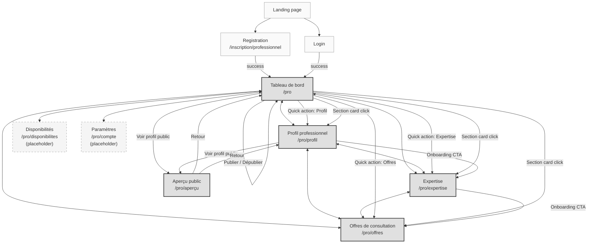

# 02 — Information Architecture, Screen Inventory & Navigation Map

> Defines the complete navigation hierarchy, screen inventory, and navigation map for the Professional Space. Publication is removed from the sidebar — it becomes a Dashboard action. The Public Preview is a first-class read-only page.

---

## 1. Navigation Hierarchy

### Sidebar (Desktop / Tablet)

```
Espace Professionnel
│
├── Tableau de bord          → /pro
├── Profil professionnel     → /pro/profil
├── Expertise                → /pro/expertise
├── Offres de consultation   → /pro/offres
├── Disponibilités           → /pro/disponibilites    [Future — placeholder]
└── Paramètres du compte     → /pro/compte            [Future — placeholder]
```

### Bottom Tab Bar (Mobile)

```
[Tableau de bord] [Profil] [Expertise] [Offres] [Plus ▾]
```

"Plus" opens a sheet with: Disponibilités (bientôt), Paramètres (bientôt), Retour au site.

### No "Publication" Item

Publishing is an **action**, not a **destination**. The publish/unpublish action lives on the Dashboard. The Public Preview is accessible from multiple entry points but is not in the sidebar.

### Public Preview Entry Points

| Entry Point | Location | Context |
|---|---|---|
| Dashboard | "Voir mon profil public" button | After completion check |
| Profile Hero | "Voir profil public" button | Top-right of hero section |
| Quick Actions | "Aperçu" link | Quick actions row on Dashboard |
| Post-save toast | "Voir l'aperçu" link (optional) | After saving any card [Next] |

---

## 2. Data Ownership Map

Each entity belongs to exactly one section. No duplication.

| Section | Entities Owned | Can Read |
|---|---|---|
| **Tableau de bord** | Publication (status, publishedAt) | All entities (for completion + preview) |
| **Profil professionnel** | Identity, Biography, ProfessionalContact, Office, Education[], Experience[], Certification[], Membership[] | — |
| **Expertise** | Expertise (Specializations, PracticeAreas, Languages) | — |
| **Offres de consultation** | ConsultationOffer[] | Expertise (for preview context) |
| **Aperçu public** | — (read-only) | All entities |
| **Disponibilités** [Future] | Availability | — |
| **Paramètres** [Future] | User (email, password, notifications) | — |

---

## 3. Section-to-Entity Mapping

### Tableau de bord (Dashboard)

| UI Element | Data Source | Version |
|---|---|---|
| Status banner | ProfessionalProfile.status, publishedAt | MVP |
| Completion progress | Computed from all sections | MVP |
| Section status cards | Completion booleans | MVP |
| Publish / Unpublish button | Publication action | MVP |
| Quick actions | Navigation links | MVP |
| Profile preview thumbnail | Identity (photo, name, title), Office (city) | MVP |
| Recent activity | Activity log [Future] | Future |
| Notifications | Notification system [Future] | Future |
| KPIs | Statistics [Future] | Future |

### Profil professionnel

| Card | Entity | Fields | Version |
|---|---|---|---|
| Hero | Identity + Publication | photo, name, professionalTitle, barAssociation, completion %, preview button | MVP |
| Identité | Identity | firstName, lastName, professionalTitle, photoUrl, barAssociationId | MVP |
| Biographie | Biography | bio (max 600) | MVP |
| Coordonnées professionnelles | ProfessionalContact | phone | MVP |
| Coordonnées professionnelles | ProfessionalContact | whatsapp, publicEmail, website, linkedInUrl | Next |
| Cabinet | Office | name, address, cityId | MVP |
| Cabinet | Office | googleMapsUrl, latitude, longitude | Next |
| Formation | Education[] | degree, institution, startYear, endYear, description | Next |
| Expérience professionnelle | ProfessionalExperience[] | position, organization, startYear, endYear, current, description | Next |
| Certifications | Certification[] | title, issuer, issueYear, expiryYear, credentialId | Next |
| Adhésions professionnelles | ProfessionalMembership[] | organization, role, startYear, endYear | Next |
| Langues | Expertise (languages) | languageIds | MVP |

> **Note on Languages**: Languages appear both in Expertise (where they're selected) and in Profile (where they're displayed as a read-only card in the public view). The **write owner** is Expertise. The Profile card is read-only — it displays what was selected in Expertise. This avoids duplication while giving the Profile page a complete view.

### Expertise

| Section | Entity | Fields | Version |
|---|---|---|---|
| Spécialités | Expertise → Specializations | specializationIds (toggle cards) | MVP |
| Situations traitées | Expertise → PracticeAreas | practiceAreaIds (grouped by specialization) | MVP |
| Langues de consultation | Expertise → Languages | languageIds (chips) | MVP |

### Offres de consultation

| Card | Entity | Fields | Version |
|---|---|---|---|
| Offer card (repeatable) | ConsultationOffer | title, price, currency, durationMinutes, modalities, active | MVP |
| Offer card (repeatable) | ConsultationOffer | description | Next |
| Live preview (sticky) | ConsultationOffer + Identity | Full client-facing preview | MVP |
| "Ajouter une offre" | — | Create new offer | MVP |

### Aperçu public (Public Preview)

| Section | Data Source | Version |
|---|---|---|
| Profile header | Identity + Office + BarAssociation | MVP |
| Biographie | Biography | MVP |
| Expertise (specializations + practice areas) | Expertise | MVP |
| Langues | Expertise (languages) | MVP |
| Offres de consultation | ConsultationOffer[] (active only) | MVP |
| Coordonnées | ProfessionalContact | MVP |
| Cabinet | Office | MVP |
| Formation | Education[] | Next |
| Expérience | ProfessionalExperience[] | Next |
| Certifications | Certification[] | Next |
| Adhésions | ProfessionalMembership[] | Next |
| Carte / Localisation | Office (googleMapsUrl, lat, lng) | Next |
| Avis / Reviews | Reviews [Future] | Future |
| Articles | Articles [Future] | Future |
| Statistiques | Statistics [Future] | Future |
| Vidéo de présentation | VideoPresentation [Future] | Future |
| Récompenses | Award[] | Future |
| Badge de vérification | Verification | Next |

---

## 4. Screen Inventory

### 4.1 Registration Page

| Attribute | Value |
|---|---|
| **Route** | `/inscription/professionnel` |
| **Purpose** | Create a new professional account |
| **Entry points** | Landing page CTA, "Devenir professionnel" link |
| **Exit points** | Dashboard (`/pro`) on success, Login page |
| **Dependencies** | Auth system |
| **Required data** | email, password, confirmPassword |
| **Actions** | Register (email), Register (Google), Navigate to login |
| **Version** | MVP (existing, minor UI refresh) |

### 4.2 Dashboard (Tableau de bord)

| Attribute | Value |
|---|---|
| **Route** | `/pro` |
| **Purpose** | Cockpit: answer "Where am I?", "What's missing?", "What should I do next?", "What happened?" |
| **Entry points** | After login, sidebar nav, bottom tab bar, post-registration redirect |
| **Exit points** | Profile, Expertise, Offers, Public Preview, Account Settings |
| **Dependencies** | ProfessionalProfile (full), Completion computation |
| **Required data** | Identity, Expertise, Offers, Publication status, Completion |
| **Actions** | Navigate to sections, Publish, Unpublish, View public preview, Quick actions |
| **Version** | MVP (core), Next (activity feed), Future (KPIs, notifications) |

### 4.3 Professional Profile

| Attribute | Value |
|---|---|
| **Route** | `/pro/profil` |
| **Purpose** | Build a professional identity — hero + modular editable cards |
| **Entry points** | Sidebar, Dashboard section card, bottom tab bar |
| **Exit points** | Dashboard, Expertise (via onboarding CTA), Public Preview |
| **Dependencies** | Identity, Biography, ProfessionalContact, Office, Education[], Experience[], Certification[], Membership[], BarAssociation, City referentials |
| **Required data** | All profile entities |
| **Actions** | Edit/save each card independently, Upload photo, Add/remove timeline entries, View public preview |
| **Version** | MVP (identity, bio, contact, office), Next (education, experience, certifications, memberships) |

### 4.4 Expertise

| Attribute | Value |
|---|---|
| **Route** | `/pro/expertise` |
| **Purpose** | Define specializations, practice areas, and consultation languages |
| **Entry points** | Sidebar, Dashboard section card, bottom tab bar, onboarding CTA |
| **Exit points** | Dashboard, Offers (via onboarding CTA) |
| **Dependencies** | Expertise entity, Specialization/PracticeArea/Language referentials |
| **Required data** | specializationIds, practiceAreaIds, languageIds |
| **Actions** | Toggle specializations, Toggle practice areas (grouped), Toggle languages, Save |
| **Version** | MVP |

### 4.5 Consultation Offers

| Attribute | Value |
|---|---|
| **Route** | `/pro/offres` |
| **Purpose** | Manage multiple consultation offers with live client preview |
| **Entry points** | Sidebar, Dashboard section card, bottom tab bar, onboarding CTA |
| **Exit points** | Dashboard, Public Preview |
| **Dependencies** | ConsultationOffer[], Identity (for preview), Expertise (for preview) |
| **Required data** | offers[] (title, price, duration, modalities, active) |
| **Actions** | Add offer, Edit offer, Delete offer, Activate/deactivate offer, View live preview |
| **Version** | MVP |

### 4.6 Public Preview

| Attribute | Value |
|---|---|
| **Route** | `/pro/aperçu` |
| **Purpose** | Read-only rendering of the public profile exactly as clients see it |
| **Entry points** | Dashboard button, Profile hero button, Quick actions |
| **Exit points** | Dashboard (back button), Profile (back button) |
| **Dependencies** | All profile entities (read-only) |
| **Required data** | All published data |
| **Actions** | None (read-only). "Retour" navigation. |
| **Version** | MVP (core sections), Next (education, experience, certifications, office map), Future (reviews, articles, video) |

### 4.7 Availability (Placeholder)

| Attribute | Value |
|---|---|
| **Route** | `/pro/disponibilites` |
| **Purpose** | Manage calendar availability (future) |
| **Entry points** | Sidebar, bottom tab bar "Plus" |
| **Exit points** | Dashboard |
| **Dependencies** | None (placeholder) |
| **Required data** | None |
| **Actions** | None (placeholder) |
| **Version** | Future |

### 4.8 Account Settings (Placeholder)

| Attribute | Value |
|---|---|
| **Route** | `/pro/compte` |
| **Purpose** | Manage account-level settings (future) |
| **Entry points** | Sidebar, bottom tab bar "Plus" |
| **Exit points** | Dashboard |
| **Dependencies** | None (placeholder) |
| **Required data** | None |
| **Actions** | None (placeholder) |
| **Version** | Future |

---

## 5. Navigation Map



### Navigation Rules

1. **Sidebar is always visible** on desktop (collapsible). All sidebar items are mutually navigable.
2. **Onboarding CTAs** appear within Profile and Expertise pages during onboarding mode (when completion is incomplete). They guide the user to the next logical step but don't block navigation.
3. **Public Preview** is a dead-end page — it only has "Retour" buttons. No sidebar on the preview page (it's a full-page view).
4. **Dashboard is the home base** — always reachable, always the first page after login/registration.
5. **Publish action** is a modal/confirmation on the Dashboard — it doesn't navigate away.
6. **Mobile bottom tab bar** has 4 main items + "Plus" for secondary. Preview is accessed via buttons, not the tab bar.

---

## 6. Future Extension Points

| Future Feature | Where It Plugs In | How |
|---|---|---|
| Reviews | Public Preview (new section) | New card below offers |
| Articles | Sidebar (new item) + Public Preview | New nav item + new card |
| Awards | Profile page (new card) + Public Preview | New card after Certifications |
| Verified documents | Profile page (badge on cards) + Verification entity | Badge overlay on Identity, Contact, Office cards |
| Video presentation | Profile page (new card) + Public Preview | New card in Profile, new section in Preview |
| Statistics | Dashboard (new card/section) | New KPI cards on Dashboard |
| Publications | Sidebar (new item) + Public Preview | New nav item |
| Multiple consultation services | Offers page (already 1:N) | Already supported by 1:N offers |
| Professional memberships | Profile page (new card) + Public Preview | Already in schema [Next] |
| Availability | Sidebar item (already placeholder) | Activate placeholder, build calendar UI |
| Messaging | Sidebar (new item) + Dashboard (notification badge) | New nav item with badge |

### Architecture Principle

> New features = new cards or new sidebar items. **Never** redesign existing pages. The card-based architecture means adding a feature is additive, not disruptive.
